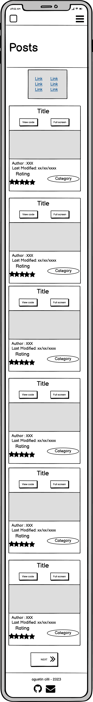
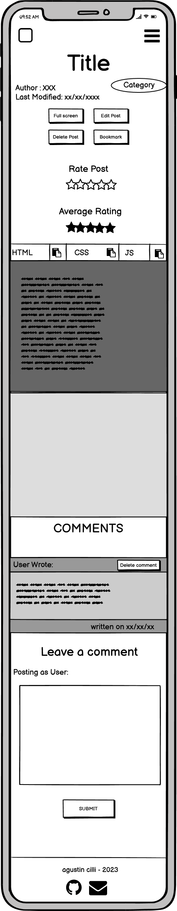
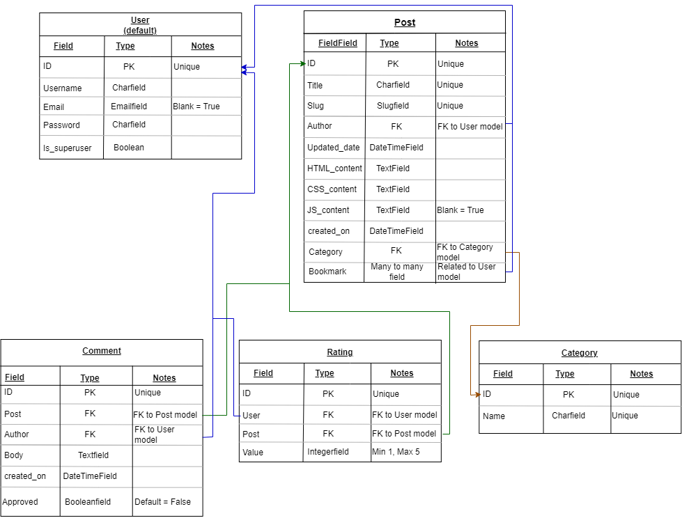

# CODEPOOL

Codepool is an innovative website designed specifically for web developers. It's a one-stop-shop for all your code component needs, providing you with access to a vast collection of HTML, CSS, and JS snippets created and shared by the community. As a registered user, you can contribute to the pool of knowledge by uploading your own code components, whether they be simple buttons, stylish navbars, or complex loaders. The platform makes it easy for you to showcase your skills with coders from around the world.

Codepool also provides a platform for users to rate and comment on other users' posts, helping to build a community of developers who support and encourage each other. You can keep track of your favorite code snippets by bookmarking them, saving them for later use or referencing. The platform is user-friendly, making it simple to find what you're looking for, and the code can be accessed and previewed by everyone, even non-registered users.

Whether you're a seasoned developer or just starting out, Codepool is the perfect place to expand your knowledge and build your code library. With its growing community of coders and wealth of resources, you'll never run out of new and exciting code components to explore. So why wait? Join Codepool today and take your coding skills to the next level!


* placeholder for Am I Responsive

## UX

The user experience of Codepool is designed to be modern and intuitive, with a dark theme that is both visually appealing and easy on the eyes. When you first access the website, you are presented with a list of posts, each previewed in a compact card that provides basic information about the code component. The card includes the title, author, last modified date, rating, and category, as well as a preview of the code displayed within an iframe. This card are also used in the post, categories and bookmarked templates.

The templates for adding or editing posts and categories have a minimalistic design, focusing on efficiency and ease of use for both regular users and superusers. The interface is clean and straightforward, with clear fields for entering necessary information, streamlining the process and allowing for quick and hassle-free updates to your code components. This design approach ensures that the user experience is fast and focused, allowing you to easily keep your code library organized and up-to-date.

### Colour Scheme

The color of rgb(50, 61, 77) sets the tone for the website. The navbar and footer are also in a dark shade, using the color rgb(39, 49, 62). The forms for registering and logging in use the color rgb(22, 31, 40), providing a contrast to the lighter elements of the site. Buttons on the site come in a range of colors, including white, gray, orange, yellow, green, and red, adding visual interest and highlighting important actions. The preview cards are given additional depth with a dark gradient texture, making the code components stand out. The text throughout the site is mainly white, with gray tones used to emphasize certain parts and guide the user's eye.


I've used CSS `:root` variables to easily update the global colour scheme by changing only one value, instead of everywhere in the CSS file.

```css
:root {
    --gray-1: rgb(50, 61, 77);
    --gray-2: rgb(39, 49, 62);
    --gray-3: rgb(28, 39, 50);
    --gray-4: rgb(22, 31, 40);
    --gray-5: rgb(15, 21, 27);
    --text-gray: rgb(118, 118, 118);
    --cream: rgb(191, 192, 192);
    --white: rgb(229, 229, 229);
    --html-orange: rgb(247, 98, 28);
    --css-blue: rgb(0, 167, 221);
    --js-yellow: rgb(247, 193, 52);
    --blue: rgb(91, 191, 186);
    --yellow: rgb(255, 205, 57);
    --red: rgb(132, 32, 41);
    --green: rgb(71, 159, 118);
    --orange: rgb(237 154 84);
    --black-texture-background:
        radial-gradient(at top left, rgba(0, 0, 0, .5) 0%, rgba(0, 0, 255, 0) 40%),
        radial-gradient(at bottom left, rgba(0, 0, 0, .5) 10%, rgba(0, 0, 255, 0) 60%),
        radial-gradient(at top right, rgba(0, 0, 0, .5) 0%, rgba(0, 0, 255, 0) 60%),
        radial-gradient(at bottom right, rgba(0, 0, 0, .5) 10%, rgba(0, 0, 255, 0) 50%),
        linear-gradient(var(--gray-3), var(--gray-3));
}
```

### Typography

The site uses a mix of fonts to create a unique and modern look. This are provided by [Google Fonts](https://fonts.google.com/) The default font is [Roboto](https://fonts.google.com/specimen/Roboto), which provides a clean and versatile base. [Raleway](https://fonts.google.com/specimen/Raleway) is used for buttons, adding a touch of personality. [Roboto Mono](https://fonts.google.com/specimen/Roboto+Mono) is used for badges, textareas (that are styled as terminals) and main titles in index, posts and filtered posts templates to give a modern and computerized look. Finally, [Fira Sans](https://fonts.google.com/specimen/Fira+Sans) is used for some titles and the navbar, providing a bold and distinctive touch. These font choices work together to create a cohesive and visually appealing design.

[Font Awesome](https://fontawesome.com/) is also used to add different icons throughout the website

## User Stories

The user stories were broken down with 3 types of users in mind: "users" (non-registered users who can access the website), "Registered Users," and "Site Admins."

### Regular users (non registered)

- As a User I can view all the code components shared so that copy them and use them in my own projects
- As a User I can filter the code components by category or bookmarked posts so that I can easily find the post that I want
- As a user I can open a component shared so that see the code used in HTML, CSS and Js
- As a user I can View comments in posts so that see what other people think
- As a user I can regsiter and become a registered user so that comment and like posts, and create my own posts
- As a user I can preview shared elements so that decide if I am interested in the element before looking at the code
- As a User I can view the newest code components shared on the home page so that I can easily be updated with the newest components
- As a User I can open the iframe in full screen on the preview cards so that I can see the code component in a bigger scale

### Registered Users

- As a registered user I can delete a post created by me so that I can remove it completely in case I don´t want it on the website
- As a registered user I can edit my own posts so that make a correction in case I have a mistake
- As a Registered User I can comment posts so that I can share my opinion about other users components
- As a Registered User I can create a post with my code so that I can share and store somewhere the components I created
- As a Registered User I can add or remove a post to bookmarked so that easily find it
- As a Registered user I can rate a post from 1 to 5 so that share my opinion and view other users opinions
- As a registered user I can delete my comments from any post so that take down my comment if i commented on the wrong post

### Site Admin

- As a Site admin I can delete posts and comments so that manage the content in the site
- As a Site Admin I can approve comments so that I can filter unnecessary comments in the website

## Wireframes

To follow best practice, wireframes were developed for mobile, tablet, and desktop sizes.
I've used [Balsamiq](https://balsamiq.com/wireframes) to design my site wireframes.

### Index Wireframes
<details>
<summary>View Wireframes</summary>

| Size | Screenshot |
| --- | --- |
| Mobile |  |
| Tablet |  |
| Desktop |  |

</details>

### Posts Wireframes
<details>
<summary>View Wireframes</summary>

| Size | Screenshot |
| --- | --- |
| Mobile |  |
| Tablet |  |
| Desktop |  |

</details>

### Category filtered Posts Wireframes
<details>
<summary>View Wireframes</summary>

| Size | Screenshot |
| --- | --- |
| Mobile |  |
| Tablet |  |
| Desktop |  |

</details>

### Bookmarked filtered Posts Wireframes
<details>
<summary>View Wireframes</summary>

| Size | Screenshot |
| --- | --- |
| Mobile |  |
| Tablet |  |
| Desktop |  |

</details>

### Post Detail Wireframes
<details>
<summary>View Wireframes</summary>

| Size | Screenshot |
| --- | --- |
| Mobile |  |
| Tablet |  |
| Desktop |  |

</details>

### Edit Post Wireframes
<details>
<summary>View Wireframes</summary>

| Size | Screenshot |
| --- | --- |
| Mobile |  |
| Tablet |  |
| Desktop |  |

</details>

### Delete Post Wireframes
<details>
<summary>View Wireframes</summary>

| Size | Screenshot |
| --- | --- |
| Mobile |  |
| Tablet |  |
| Desktop |  |

</details>

### Delete Comment Wireframes
<details>
<summary>View Wireframes</summary>

| Size | Screenshot |
| --- | --- |
| Mobile |  |
| Tablet |  |
| Desktop |  |

</details>

### Add Post Wireframes
<details>
<summary>View Wireframes</summary>

| Size | Screenshot |
| --- | --- |
| Mobile |  |
| Tablet |  |
| Desktop |  |

</details>

### Category List Wireframes
<details>
<summary>View Wireframes</summary>

| Size | Screenshot |
| --- | --- |
| Mobile |  |
| Tablet |  |
| Desktop |  |

</details>

### Add Category Wireframes
<details>
<summary>View Wireframes</summary>

| Size | Screenshot |
| --- | --- |
| Mobile |  |
| Tablet |  |
| Desktop |  |

</details>

### Edit Category Wireframes
<details>
<summary>View Wireframes</summary>

| Size | Screenshot |
| --- | --- |
| Mobile |  |
| Tablet |  |
| Desktop |  |

</details>

### Delete Category Wireframes
<details>
<summary>View Wireframes</summary>

| Size | Screenshot |
| --- | --- |
| Mobile |  |
| Tablet |  |
| Desktop |  |

</details>

### SignIn Wireframes
<details>
<summary>View Wireframes</summary>

| Size | Screenshot |
| --- | --- |
| Mobile |  |
| Tablet |  |
| Desktop |  |

</details>

### SignUp Wireframes
<details>
<summary>View Wireframes</summary>

| Size | Screenshot |
| --- | --- |
| Mobile |  |
| Tablet |  |
| Desktop |  |

</details>

### SignOut Wireframes
<details>
<summary>View Wireframes</summary>

| Size | Screenshot |
| --- | --- |
| Mobile |  |
| Tablet |  |
| Desktop |  |

</details>

## Features

### Existing Features

- **Navbar**

    - The navbar on your website has a dark theme with white links for a contrasting appearance. On mobile devices, the navbar collapses into a hamburger menu for a more compact viewing experience. When opened, the menu displays a column of links coming from the right edge of the screen, casting an overlay on the rest of the page.
    The navbar is dynamically populated based on the user's status, providing personalized information and access to relevant features. For all users, the links to the index, all posts template, log in/register, and log out are displayed. Registered users are able to see the link to create a new post, while only the site admin is able to see the links to view the list of categories and create a new one. When a regisred user hovers the navbar it will wxtend to show the user´s username.


- **Preview Card**

    - The preview card is a feature that provides basic information about a post on the website. It is visible on the index, posts, categories filtered posts, and bookmarked templates. The preview card displays the post title, the author's last modification date, and a small preview of the code displayed in an iframe. Additionally, there are two buttons: one that links to the post detail for that specific post, and another that shows the iframe in full screen. The average rating of the post is also displayed, along with a badge indicating the post's category. If a registered user has bookmarked the post, a small badge will also be displayed to note this.


- **Post Detail Header**

    - The post detail header is an important feature on the website that displays key information about each post. This includes the post title, author, last modification date, category, and bookmarked status. If the user is a registered user, they can bookmark the post for future reference and, if they are the creator of the post or a site admin, they can also delete or edit the post. The average rating of the post is visible to all users, as well as the number of votes it has received. Only registered users can rate the post by using the five rating buttons. The full screen button is also available for all users to easily view the post's code in a larger format.


- **Rating system**

    - The rating system on the website allows registered users to rate posts with a star rating system. The rating system is represented by 5 buttons in the form of empty stars. When a user hovers over a button, the style changes to fill them and add them color reflecting the selected rating and the previous stars are also updated. Upon clicking one of these buttons, the user's vote is recorded and added to the total rating of the post. The average rating of the post is visible to all users and is represented by icons. These icons dynamically change their design based on the average rating, with full stars representing a high rating and partially filled stars representing the decimals.


- **Post Detail Body**

    - The post detail body feature provides a detailed view of the code for a specific post. There are three buttons that allow users to show or hide the different text areas where the HTML, CSS, and JS code are written. On small screens, only one text area will be displayed at a time. There are also buttons that allow users to easily copy the code from each text area to their clipboard. In addition to the text areas, there is another iframe that allows users to interact with and see the code in action.


- **Comment Section**

    - The comment section of the post detail page displays all of the comments made by users. The comments are displayed in small cards, each with a different color to distinguish them easily. The cards include the author's name, the comment body, and the date it was created. The author of the comment can delete their comment using a button that is only visible to them or the site admin. All comments must be approved by the site admin, who can view and approve them using a button in this section (this comments are always positioned on top with a different color so the admin can distinguish them). At the bottom of the comment section is a text area where registered users can write and submit their own comments. This feature allows for a rich and interactive community experience where users can engage with one another and share their thoughts and ideas.


- **Filter Posts Navigation**

    - The filter posts navigation feature is a dynamic navigation element that provides users with quick and easy access to different categories of posts. It is populated with all the categories, bookmarked posts (for registered users only), and a link to view all posts. This feature allows users to quickly filter posts based on their interests or needs. Clicking on a category, bookmarked post, or all posts link will call the corresponding view and display only the selected posts.


- **Browse Categories Section**

    - The browse categories section is a feature used exclusively by site administrators as it allows them to manage and maintain the different categories available for posts on the website. The section displays all the post categories in a list format and provides two important links for each category. The first link allows the administrator to delete the category and the second link allows them to edit it. This section provides a centralized and organized way for administrators to manage the categories on the website and helps to keep the content of the site organized and easily accessible to users.


### Future Features

- Admin Panel:
    - It would be useful to create a template where administrators can see all the information related to posts and comments in one place, rather than having to access the post details to edit or delete them.

- Page for Registered Users:
    - A page where users can view information about registered users, as well as all the posts and comments they have made. This page could also include a profile picture and links to their social media profiles, such as LinkedIn or GitHub.


## Tools & Technologies Used

- [HTML](https://en.wikipedia.org/wiki/HTML) used for the main site content.
- [CSS](https://en.wikipedia.org/wiki/CSS) used for the main site design and layout.
- [CSS :root variables](https://www.w3schools.com/css/css3_variables.asp) used for reusable styles throughout the site.
- [CSS Flexbox](https://www.w3schools.com/css/css3_flexbox.asp) and [CSS Grid](https://www.w3schools.com/css/css_grid.asp) used for an enhanced responsive layout.
- [Bootstrap](https://getbootstrap.com) used as the front-end CSS framework for modern responsiveness and pre-built components.
- [JavaScript](https://www.javascript.com) used for user interaction on the site.
- [Python](https://www.python.org) used as the back-end programming language.
- [Git](https://git-scm.com) used for version control. (`git add`, `git commit`, `git push`)
- [GitHub](https://github.com) used for secure online code storage.
- [Gitpod](https://gitpod.io) used as a cloud-based IDE for development.
- [Markdown Builder by Tim Nelson](https://traveltimn.github.io/markdown-builder) used to help generate the Markdown files.
- [Django](https://www.djangoproject.com) used as the Python framework for the site.
- [ElephantSQL](https://www.elephantsql.com) used as the Postgres database.
- [Heroku](https://www.heroku.com) used for hosting the deployed back-end site.
- [Cloudinary](https://cloudinary.com) used for online static file storage.

## Database Design

Here are the different models created for the database. The only model not included is the user model that is a default model provided by Django.


```python
class Post(models.Model):
    title = models.CharField(max_length=100, unique=True)
    slug = models.SlugField(max_length=100, unique=True)
    author = models.ForeignKey(
        User, on_delete=models.CASCADE, related_name='forum_posts'
        )
    updated_date = models.DateTimeField(auto_now=True)
    html_content = models.TextField()
    css_content = models.TextField()
    js_content = models.TextField(blank=True)
    created_on = models.DateTimeField(auto_now_add=True)
    category = models.ForeignKey(
        Category, max_length=60, on_delete=models.CASCADE,
        related_name='catego')
    bookmark = models.ManyToManyField(
        User, related_name="forum_favorutes", blank=True
        )
```

```python
class Category(models.Model):
    name = models.CharField(max_length=255, unique=True)
```

```python
class Rating(models.Model):
    user = models.ForeignKey(User, on_delete=models.CASCADE)
    post = models.ForeignKey(Post, on_delete=models.CASCADE)
    value = models.IntegerField(
        validators=[MinValueValidator(1), MaxValueValidator(5)])
```

```python
class Comment(models.Model):
    post = models.ForeignKey(
        Post, on_delete=models.CASCADE, related_name='comments'
    )
    author = models.ForeignKey(
        User, on_delete=models.CASCADE, related_name='forum_comments',
        null=True, blank=True
        )
    body = models.TextField()
    created_on = models.DateTimeField(auto_now_add=True)
    approved = models.BooleanField(default=False)
```

<details>
<summary>View related models</summary>

 

</details>

## Agile Development Process

### GitHub Projects

[GitHub Projects](https://github.com/cilliagustin/codepool/projects) served as a versatile Agile tool for this project, though it may not be specifically designed for this purpose. However, with proper tagging and project management, it was effectively utilized.

This platform allowed for effective planning and tracking of user stories, tasks, and project milestones through the use of a simple Kanban board, updated on a weekly basis.


### GitHub Issues

[GitHub Issues](https://github.com/cilliagustin/codepool/issues) served as an another Agile tool.
There, I used my own **User Story Template** to manage user stories.

It also helped with milestone iterations on a weekly basis.


- [Open Issues](https://github.com/cilliagustin/codepool/issues)

    

- [Closed Issues](https://github.com/cilliagustin/codepool/issues?q=is%3Aissue+is%3Aclosed)

    

## Testing

For all testing, please refer to the [TESTING.md](TESTING.md) file.

## Deployment

The live deployed application can be found deployed on [Heroku](https://code-pool-agustin-cilli.herokuapp.com).

### ElephantSQL Database

This project uses [ElephantSQL](https://www.elephantsql.com) for the PostgreSQL Database.

To obtain your own Postgres Database, sign-up with your GitHub account, then follow these steps:
- Click **Create New Instance** to start a new database.
- Provide a name (this is commonly the name of the project: codepool).
- Select the **Tiny Turtle (Free)** plan.
- You can leave the **Tags** blank.
- Select the **Region** and **Data Center** closest to you.
- Once created, click on the new database name, where you can view the database URL and Password.

### Cloudinary API

This project uses the [Cloudinary API](https://cloudinary.com) to store media assets online, due to the fact that Heroku doesn't persist this type of data.

To obtain your own Cloudinary API key, create an account and log in.
- For *Primary interest*, you can choose *Programmable Media for image and video API*.
- Optional: *edit your assigned cloud name to something more memorable*.
- On your Cloudinary Dashboard, you can copy your **API Environment Variable**.
- Be sure to remove the `CLOUDINARY_URL=` as part of the API **value**; this is the **key**.

### Heroku Deployment

This project uses [Heroku](https://www.heroku.com), a platform as a service (PaaS) that enables developers to build, run, and operate applications entirely in the cloud.

Deployment steps are as follows, after account setup:

- Select **New** in the top-right corner of your Heroku Dashboard, and select **Create new app** from the dropdown menu.
- Your app name must be unique, and then choose a region closest to you (EU or USA), and finally, select **Create App**.
- From the new app **Settings**, click **Reveal Config Vars**, and set your environment variables.

| Key | Value |
| --- | --- |
| `CLOUDINARY_URL` | insert your own Cloudinary API key here |
| `DATABASE_URL` | insert your own ElephantSQL database URL here |
| `DISABLE_COLLECTSTATIC` | 1 (*this is temporary, and can be removed for the final deployment*) |
| `SECRET_KEY` | this can be any random secret key |

Heroku needs two additional files in order to deploy properly.
- requirements.txt
- Procfile

You can install this project's **requirements** (where applicable) using:
- `pip3 install -r requirements.txt`

If you have your own packages that have been installed, then the requirements file needs updated using:
- `pip3 freeze --local > requirements.txt`

The **Procfile** can be created with the following command:
- `echo web: gunicorn app_name.wsgi > Procfile`
- *replace **app_name** with the name of your primary Django app name; the folder where settings.py is located*

For Heroku deployment, follow these steps to connect your own GitHub repository to the newly created app:

Either:
- Select **Automatic Deployment** from the Heroku app.

Or:
- In the Terminal/CLI, connect to Heroku using this command: `heroku login -i`
- Set the remote for Heroku: `heroku git:remote -a app_name` (replace *app_name* with your app name)
- After performing the standard Git `add`, `commit`, and `push` to GitHub, you can now type:
	- `git push heroku main`

The project should now be connected and deployed to Heroku!

### Local Deployment

This project can be cloned or forked in order to make a local copy on your own system.

For either method, you will need to install any applicable packages found within the *requirements.txt* file.
- `pip3 install -r requirements.txt`.

You will need to create a new file called `env.py` at the root-level,
and include the same environment variables listed above from the Heroku deployment steps.

Sample `env.py` file:

```python
import os

os.environ.setdefault("CLOUDINARY_URL", "insert your own Cloudinary API key here")
os.environ.setdefault("DATABASE_URL", "insert your own ElephantSQL database URL here")
os.environ.setdefault("SECRET_KEY", "this can be any random secret key")

# local environment only (do not include these in production/deployment!)
os.environ.setdefault("DEBUG", "True")
```

Once the project is cloned or forked, in order to run it locally, you'll need to follow these steps:
- Start the Django app: `python3 manage.py runserver`
- Stop the app once it's loaded: `CTRL+C` or `⌘+C` (Mac)
- Make any necessary migrations: `python3 manage.py makemigrations`
- Migrate the data to the database: `python3 manage.py migrate`
- Create a superuser: `python3 manage.py createsuperuser`
- Load fixtures (if applicable): `python3 manage.py loaddata file-name.json` (repeat for each file)
- Everything should be ready now, so run the Django app again: `python3 manage.py runserver`

#### Cloning

You can clone the repository by following these steps:

1. Go to the [GitHub repository](https://github.com/cilliagustin/codepool) 
2. Locate the Code button above the list of files and click it 
3. Select if you prefer to clone using HTTPS, SSH, or GitHub CLI and click the copy button to copy the URL to your clipboard
4. Open Git Bash or Terminal
5. Change the current working directory to the one where you want the cloned directory
6. In your IDE Terminal, type the following command to clone my repository:
	- `git clone https://github.com/cilliagustin/codepool.git`
7. Press Enter to create your local clone.

Alternatively, if using Gitpod, you can click below to create your own workspace using this repository.

[](https://gitpod.io/#https://github.com/cilliagustin/codepool)

Please note that in order to directly open the project in Gitpod, you need to have the browser extension installed.
A tutorial on how to do that can be found [here](https://www.gitpod.io/docs/configure/user-settings/browser-extension).

#### Forking

By forking the GitHub Repository, we make a copy of the original repository on our GitHub account to view and/or make changes without affecting the original owner's repository.
You can fork this repository by using the following steps:

1. Log in to GitHub and locate the [GitHub Repository](https://github.com/cilliagustin/codepool)
2. At the top of the Repository (not top of page) just above the "Settings" Button on the menu, locate the "Fork" Button.
3. Once clicked, you should now have a copy of the original repository in your own GitHub account!

## Credits

* [Codepen](https://codepen.io/) was the main influence to the concept of the website.
* [Create A Simple Django Blog](https://www.youtube.com/playlist?list=PLCC34OHNcOtr025c1kHSPrnP18YPB-NFi) playlist was used as an inspiration to create the different views and also to lear about how to implement categories and the forms in the website.


### Content

| Source | Location | Notes |
| --- | --- | --- |
| [Create Your Own Live Web Editor using HTML, CSS, and JavaScript](https://dev.to/varshithvhegde/create-your-own-live-web-editor-using-html-css-and-javascript-3j73) | Index, posts, filtered posts and post details | Create a code editor with HTML CSS and Js. |
| [Josh Lockhart](https://gist.github.com/codeguy/6684588) | New Post | Create slug from string in Javascript |
| [TraversyMedia](https://www.youtube.com/watch?v=POX3dT-pB4E&t=197s&ab_channel=TraversyMedia) | Index | Creating a typewritter effect using Js |
| [W3Schools](https://www.w3schools.com/howto/howto_js_copy_clipboard.asp) | Post Detail | how to copy a text to clipboard using Js |


### Media

Use this space to provide attribution links to any images, videos, or audio files borrowed from online.
A few examples have been provided below to give you some ideas.

If you're the owner (or a close acquaintance) of all media files, then make sure to specify this.
Let the assessors know that you have explicit rights to use the media files within your project.

Ideally, you should provide an actual link to every media file used, not just a generic link to the main site!
The list below is by no means exhaustive. Within the Code Institute Slack community, you can find more "free media" links
by sending yourself the following command: `!freemedia`.

| Source | Location | Type | Notes |
| --- | --- | --- | --- |
| [TinyPNG](https://tinypng.com) | entire site | image | tool for image compression |

### Acknowledgements

Use this space to provide attribution to any supports that helped, encouraged, or supported you throughout the development stages of this project.
A few examples have been provided below to give you some ideas.

- I would like to thank my Code Institute mentor, [John/Jane Doe](https://github.com/username) for their support throughout the development of this project.
- I would like to thank the [Code Institute](https://codeinstitute.net) tutor team for their assistance with troubleshooting and debugging some project issues.
- I would like to thank the [Code Institute Slack community](https://code-institute-room.slack.com) for the moral support; it kept me going during periods of self doubt and imposter syndrome.
- I would like to thank my spouse/partner (John/Jane), for believing in me, and allowing me to make this transition into software development.
- I would like to thank my employer, for supporting me in my career development change towards becoming a software developer.
