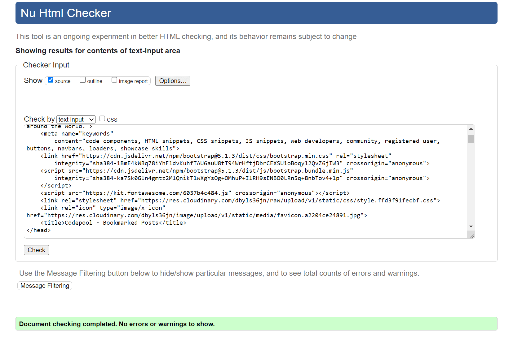
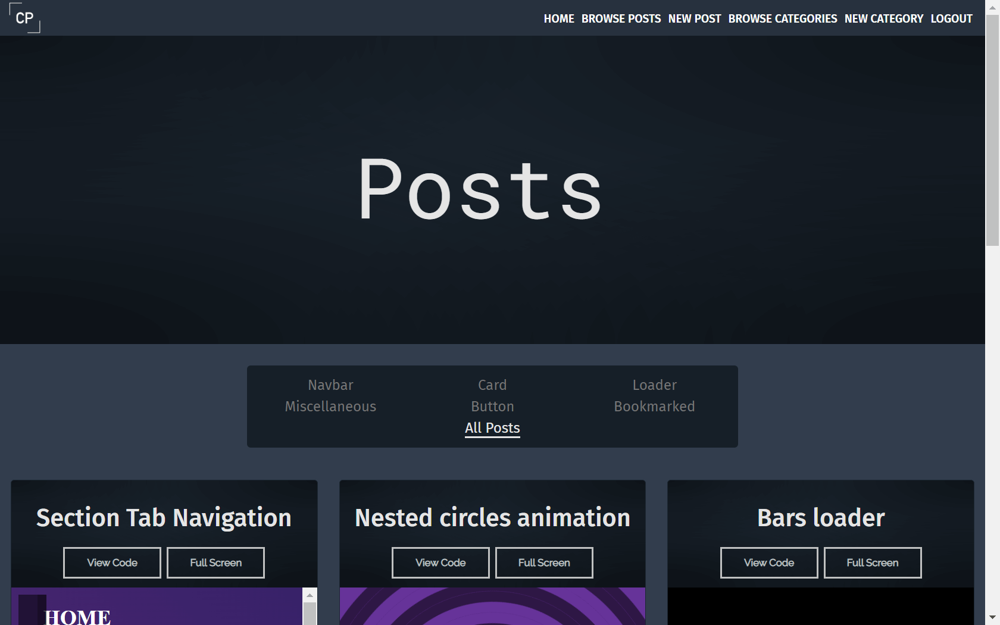
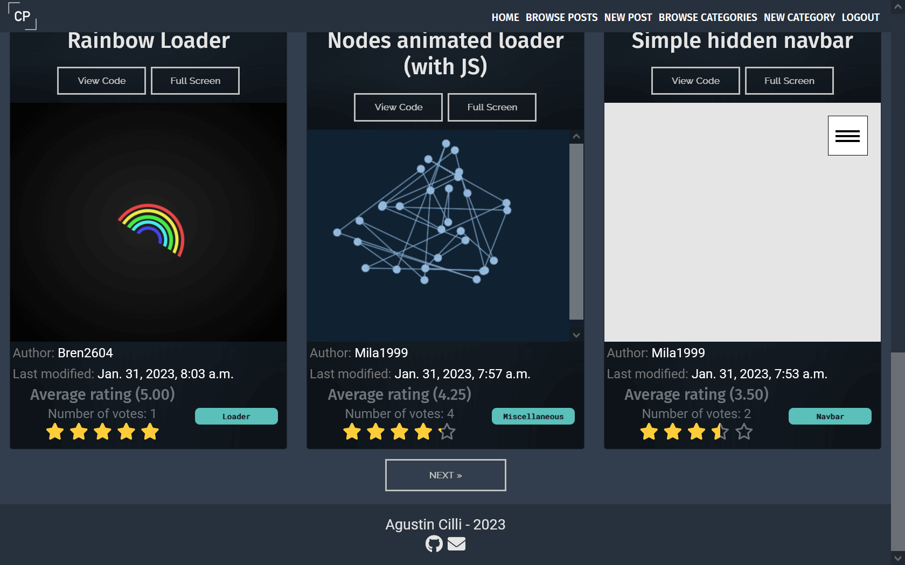
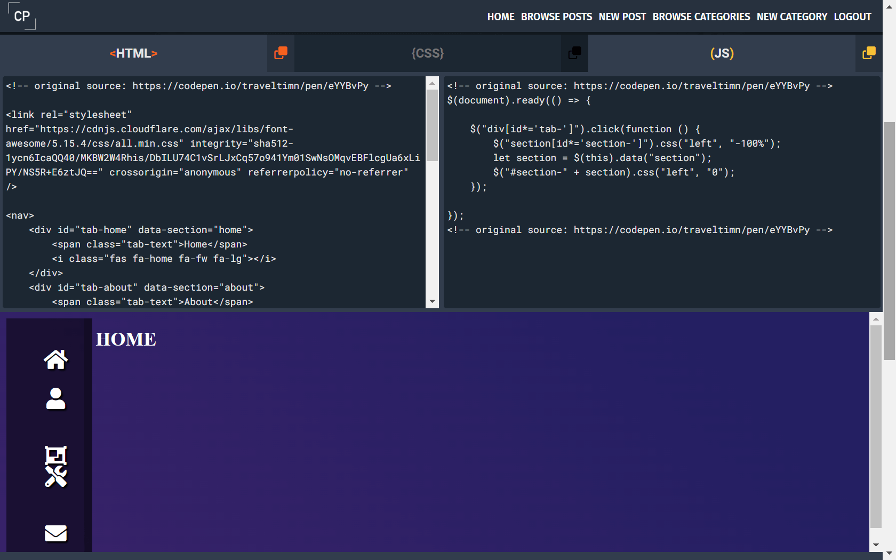
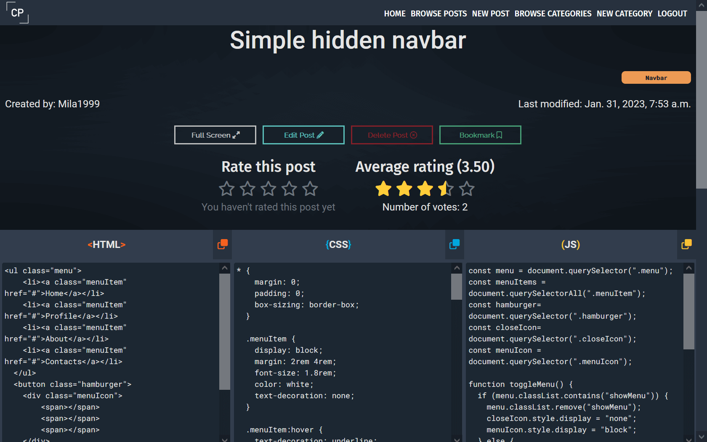
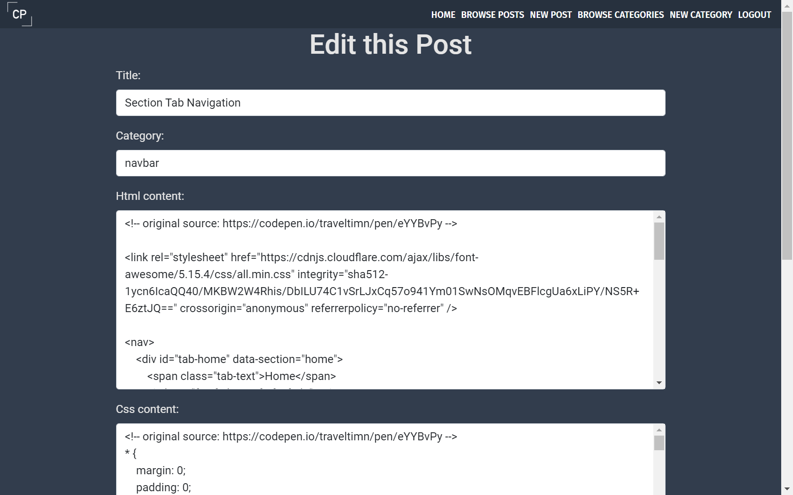
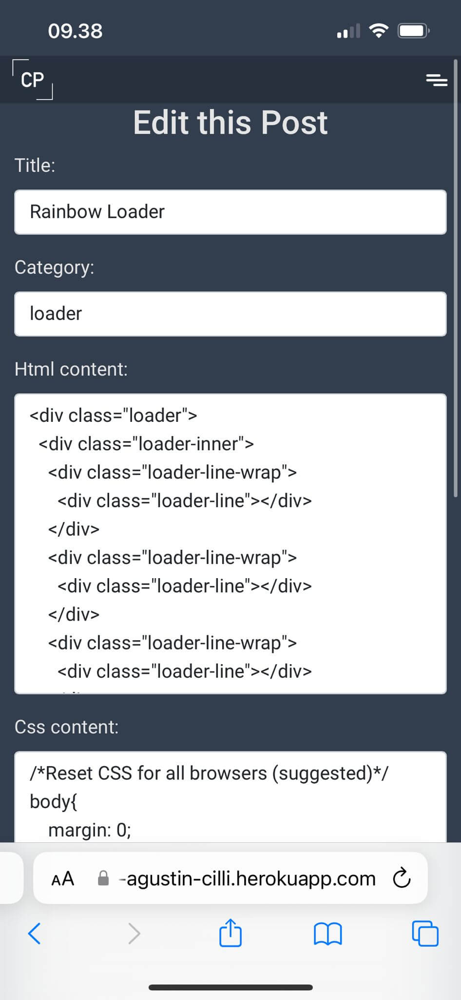
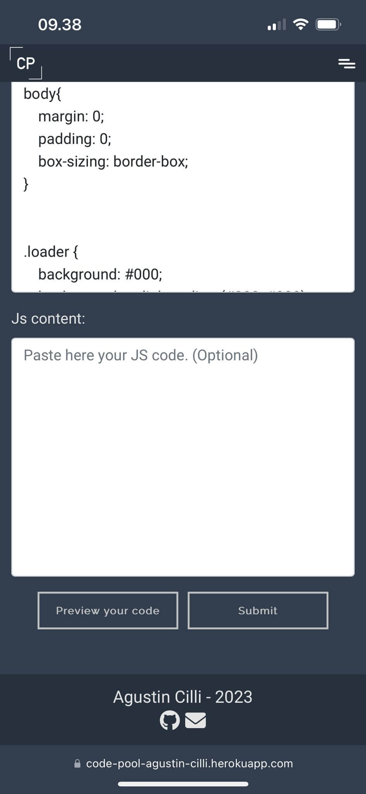
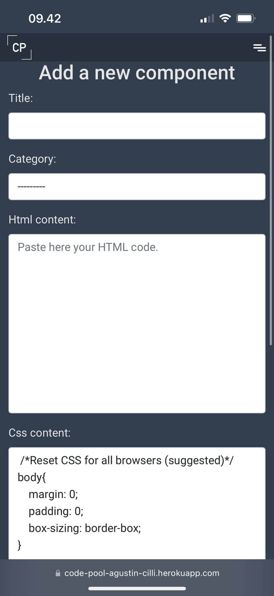
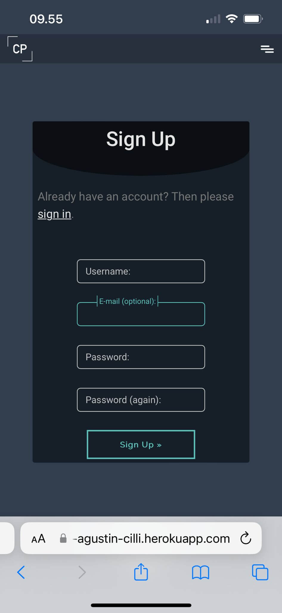

# Testing

Return back to the [README.md](README.md) file.

## Code Validation

I have used the recommended [HTML W3C Validator](https://validator.w3.org) to validate all of my HTML files. Since some of the pages requires authorisation to be accessed, some of the validation were done by checking the HTML file by entering the URL and some by copying and pasting the HTML code into the validator

| Page |  Screenshot | Type of valiation |
| --- | --- | --- |
| Index |  | Validated by URL |
| Posts |  | Validated by URL |
| Category Filtered Posts |  | Validated by URL |
| Bookmarked Posts |  | Validated by Input |
| Post detail |  | Validated by URL |
| Edit Post |  | Validated by Input |
| Delete Post |  | Validated by Input |
| Delete Comment |  | Validated by Input |
| New Post |  | Validated by Input |
| Categories |  | Validated by Input |
| Edit Category |  | Validated by Input |
| Delete Category |  | Validated by Input |
| Add Category |  | Validated by Input |
| Log Out |  | Validated by Input |
| Sign In |  | Validated by URL |
| Sign Up |  | Validated by URL |

**IMPORTANT**: Python/Jinja syntax in HTML

Python projects that use Jinja syntax, such as ``, ``, and `{{ variable|filter }}`
will not validate properly if you're copying/pasting into the HTML validator.

In order to properly validate these types of files, it's recommended to
[validate by uri](https://validator.w3.org/#validate_by_uri) from the deployed Heroku pages.

Unfortunately, pages that require a user to be logged-in and authenticated (CRUD functionality),
will not work using this method, due to the fact that the HTML Validator (W3C) doesn't have
access to login to your pages.
In order to properly validate HTML pages with Jinja syntax for authenticated pages, follow these steps:

- Navigate to the deployed pages which require authentication
- Right-click anywhere on the page, and select **View Page Source** (usually `CTRL+U` or `⌘+U` on Mac).
- This will display the entire "compiled" code, without any Jinja syntax.
- Copy everything, and use the [validate by input](https://validator.w3.org/#validate_by_input) method.
- Repeat this process for every page that requires a user to be logged-in/authenticated.

### CSS

Result from [W3C CSS Validation Service](https://jigsaw.w3.org/css-validator) for style.css. The code was validated by copying and pasting the code directly to the validator:

### JavaScript

I have used the recommended [JShint Validator](https://jshint.com) to validate all of my JS files.

| File | Screenshot | Notes |
| --- | --- | --- |
| script.js |  | Unused variables from external files |
| index.js |  | Undefined variables declared on script.js |
| post.js |  | Undefined variables declared on script.js |
| post_detail.js |  | Undefined variables declared on script.js |
| add_edit_post.js |  | Undefined variables declared on script.js |

### Python

I have used the recommended [CI Python Linter](https://pep8ci.herokuapp.com) to validate all of my Python files.

#### Codepool folder

| File | CI URL | Raw URL | Combined |
| --- | --- | --- | --- |
| Codepool *asgi.py* | `https://pep8ci.herokuapp.com/` | `https://raw.githubusercontent.com/cilliagustin/codepool/main/codepool/asgi.py` | https://pep8ci.herokuapp.com/https://raw.githubusercontent.com/cilliagustin/codepool/main/codepool/asgi.py |
| Codepool *settings.py* | `https://pep8ci.herokuapp.com/` | `https://raw.githubusercontent.com/cilliagustin/codepool/main/codepool/settings.py` | https://pep8ci.herokuapp.com/https://raw.githubusercontent.com/cilliagustin/codepool/main/codepool/settings.py |
| Codepool *urls.py* | `https://pep8ci.herokuapp.com/` | `https://raw.githubusercontent.com/cilliagustin/codepool/main/codepool/urls.py` | https://pep8ci.herokuapp.com/https://raw.githubusercontent.com/cilliagustin/codepool/main/codepool/urls.py |
| Codepool *wsgi.py* | `https://pep8ci.herokuapp.com/` | `https://raw.githubusercontent.com/cilliagustin/codepool/main/codepool/wsgi.py` | https://pep8ci.herokuapp.com/https://raw.githubusercontent.com/cilliagustin/codepool/main/codepool/wsgi.py |

#### Forum folder

| File | CI URL | Raw URL | Combined |
| --- | --- | --- | --- |
| Forum *admin.py* | `https://pep8ci.herokuapp.com/` | `https://raw.githubusercontent.com/cilliagustin/codepool/main/forum/admin.py` | https://pep8ci.herokuapp.com/https://raw.githubusercontent.com/cilliagustin/codepool/main/forum/admin.py |
| Forum *apps.py* | `https://pep8ci.herokuapp.com/` | `https://raw.githubusercontent.com/cilliagustin/codepool/main/forum/apps.py` | https://pep8ci.herokuapp.com/https://raw.githubusercontent.com/cilliagustin/codepool/main/forum/apps.py |
| Forum *forms.py* | `https://pep8ci.herokuapp.com/` | `https://raw.githubusercontent.com/cilliagustin/codepool/main/forum/forms.py` | https://pep8ci.herokuapp.com/https://raw.githubusercontent.com/cilliagustin/codepool/main/forum/forms.py |
| Forum *models.py* | `https://pep8ci.herokuapp.com/` | `https://raw.githubusercontent.com/cilliagustin/codepool/main/forum/models.py` | https://pep8ci.herokuapp.com/https://raw.githubusercontent.com/cilliagustin/codepool/main/forum/models.py |
| Forum *test_forms.py* | `https://pep8ci.herokuapp.com/` | `https://raw.githubusercontent.com/cilliagustin/codepool/main/forum/test_forms.py` | https://pep8ci.herokuapp.com/https://raw.githubusercontent.com/cilliagustin/codepool/main/forum/test_forms.py |
| Forum *test_models.py* | `https://pep8ci.herokuapp.com/` | `https://raw.githubusercontent.com/cilliagustin/codepool/main/forum/test_models.py` | https://pep8ci.herokuapp.com/https://raw.githubusercontent.com/cilliagustin/codepool/main/forum/test_models.py |
| Forum *test_views.py* | `https://pep8ci.herokuapp.com/` | `https://raw.githubusercontent.com/cilliagustin/codepool/main/forum/test_views.py` | https://pep8ci.herokuapp.com/https://raw.githubusercontent.com/cilliagustin/codepool/main/forum/test_views.py |
| Forum *urls.py* | `https://pep8ci.herokuapp.com/` | `https://raw.githubusercontent.com/cilliagustin/codepool/main/forum/urls.py` | https://pep8ci.herokuapp.com/https://raw.githubusercontent.com/cilliagustin/codepool/main/forum/urls.py |
| Forum *views.py* | `https://pep8ci.herokuapp.com/` | `https://raw.githubusercontent.com/cilliagustin/codepool/main/forum/views.py` | https://pep8ci.herokuapp.com/https://raw.githubusercontent.com/cilliagustin/codepool/main/forum/views.py |

## Browser Compatibility

I've tested my deployed project using [Chrome](https://www.google.com/chrome), [Firefox](https://www.mozilla.org/firefox) and [Safari](https://support.apple.com/downloads/safari) to check for compatibility issues.

### Index

View Browser Comparison

| Browser | Screenshot | Notes |
| --- | --- | --- |
| Chrome |  | Works as expected |
| Firefox |   | Works as expected |
| Safari |   | Works as expected |

### Posts

View Browser Comparison

| Browser | Screenshot | Notes |
| --- | --- | --- |
| Chrome |  | Works as expected |
| Firefox |   | Works as expected |
| Safari |   | Works as expected |

### Post-detail

View Browser Comparison

| Browser | Screenshot | Notes |
| --- | --- | --- |
| Chrome |   [screenshot](documentation/screenshots/chrome-post-detail-3.png)| Works as expected |
| Firefox |   [screenshot](documentation/screenshots/mozilla-post-detail-3.png) | Works as expected |
| Safari |   [screenshot](documentation/screenshots/safari-post-detail-3.jpeg) | Works as expected |

### Edit Post

View Browser Comparison

| Browser | Screenshot | Notes |
| --- | --- | --- |
| Chrome |  | Works as expected |
| Firefox |   | Works as expected |
| Safari |   | Works as expected |

### Delete Post

View Browser Comparison

| Browser | Screenshot | Notes |
| --- | --- | --- |
| Chrome |  | Works as expected |
| Firefox |  | Works as expected |
| Safari |  | Works as expected |

### New Post

View Browser Comparison

| Browser | Screenshot | Notes |
| --- | --- | --- |
| Chrome |  | Works as expected |
| Firefox |   | Works as expected |
| Safari |   | Works as expected |

### Categories

View Browser Comparison

| Browser | Screenshot | Notes |
| --- | --- | --- |
| Chrome |  | Works as expected |
| Firefox |  | Works as expected |
| Safari |  | Works as expected |

### Edit Category

View Browser Comparison

| Browser | Screenshot | Notes |
| --- | --- | --- |
| Chrome |  | Works as expected |
| Firefox |  | Works as expected |
| Safari |  | Works as expected |

### Delete Category

View Browser Comparison

| Browser | Screenshot | Notes |
| --- | --- | --- |
| Chrome |  | Works as expected |
| Firefox |  | Works as expected |
| Safari |  | Works as expected |

### New Category

View Browser Comparison

| Browser | Screenshot | Notes |
| --- | --- | --- |
| Chrome |  | Works as expected |
| Firefox |  | Works as expected |
| Safari |  | Works as expected |

### Sign In

View Browser Comparison

| Browser | Screenshot | Notes |
| --- | --- | --- |
| Chrome |  | Works as expected |
| Firefox |  | Works as expected |
| Safari |  | Works as expected |

### Sign Up

View Browser Comparison

| Browser | Screenshot | Notes |
| --- | --- | --- |
| Chrome |  | Works as expected |
| Firefox |  | Works as expected |
| Safari |  | Works as expected |

### Log Out

View Browser Comparison

| Browser | Screenshot | Notes |
| --- | --- | --- |
| Chrome |  | Works as expected |
| Firefox |  | Works as expected |
| Safari |  | Works as expected |

## Responsiveness

I've tested my deployed project on multiple devices to check for responsiveness issues. The Screenshoots provided now for the desktop and mobile versions will be the same ones shown in the browser compatibility comparision since I have checked [Google Chrome](https://www.google.com/chrome) on my desktop and [Safari](https://support.apple.com/downloads/safari) on my Iphone 14. The screenshots used for the Tablet version were taken using a tablet resolution on Chrome developer tools.

### Index

View Responsiveness Comparison

| Device | Screenshot | Notes |
| --- | --- | --- |
| Desktop |  | Works as expected |
| Tablet (Devtools) |   | Works as expected |
| Mobile (Iphone 14) |   | Works as expected |

### Posts 

View Responsiveness Comparison

| Device | Screenshot | Notes |
| --- | --- | --- |
| Desktop |  | Works as expected |
| Tablet (Devtools) |   | Works as expected |
| Mobile (Iphone 14) |   | Works as expected |

### Post-detail 

View Responsiveness Comparison

| Device | Screenshot | Notes |
| --- | --- | --- |
| Desktop |   [screenshot](documentation/screenshots/chrome-post-detail-3.png)| Works as expected |
| Tablet (Devtools) |   [screenshot](documentation/screenshots/tablet-post-detail-3.png) | Works as expected |
| Mobile (Iphone 14) |   [screenshot](documentation/screenshots/safari-post-detail-3.jpeg) | Works as expected |

### Edit Post 

View Responsiveness Comparison

| Device | Screenshot | Notes |
| --- | --- | --- |
| Desktop |  | Works as expected |
| Tablet (Devtools) |   | Works as expected |
| Mobile (Iphone 14) |   | Works as expected |

### Delete Post 

View Responsiveness Comparison

| Device | Screenshot | Notes |
| --- | --- | --- |
| Desktop |  | Works as expected |
| Tablet (Devtools) |  | Works as expected |
| Mobile (Iphone 14) |  | Works as expected |

### New Post 

View Responsiveness Comparison

| Device | Screenshot | Notes |
| --- | --- | --- |
| Desktop |  | Works as expected |
| Tablet (Devtools) |   | Works as expected |
| Mobile (Iphone 14) |   | Works as expected |

### Categories 

View Responsiveness Comparison

| Device | Screenshot | Notes |
| --- | --- | --- |
| Desktop |  | Works as expected |
| Tablet (Devtools) |  | Works as expected |
| Mobile (Iphone 14) |  | Works as expected |

### Edit Category 

View Responsiveness Comparison

| Device | Screenshot | Notes |
| --- | --- | --- |
| Desktop |  | Works as expected |
| Tablet (Devtools) |  | Works as expected |
| Mobile (Iphone 14) |  | Works as expected |

### Delete Category 

View Responsiveness Comparison

| Device | Screenshot | Notes |
| --- | --- | --- |
| Desktop |  | Works as expected |
| Tablet (Devtools) |  | Works as expected |
| Mobile (Iphone 14) |  | Works as expected |

### New Category 

View Responsiveness Comparison

| Device | Screenshot | Notes |
| --- | --- | --- |
| Desktop |  | Works as expected |
| Tablet (Devtools) |  | Works as expected |
| Mobile (Iphone 14) |  | Works as expected |

### Sign In 

View Responsiveness Comparison

| Device | Screenshot | Notes |
| --- | --- | --- |
| Desktop |  | Works as expected |
| Tablet (Devtools) |  | Works as expected |
| Mobile (Iphone 14) |  | Works as expected |

### Sign Up 

View Responsiveness Comparison

| Device | Screenshot | Notes |
| --- | --- | --- |
| Desktop |  | Works as expected |
| Tablet (Devtools) |  | Works as expected |
| Mobile (Iphone 14) |  | Works as expected |

### Log Out

View Responsiveness Comparison

| Device | Screenshot | Notes |
| --- | --- | --- |
| Desktop |  | Works as expected |
| Tablet (Devtools) |  | Works as expected |
| Mobile (Iphone 14) |  | Works as expected |

## Lighthouse Audit

Use this space to discuss testing the live/deployed site's Lighthouse Audit reports.
Avoid testing the local version (especially if developing in Gitpod), as this can have knock-on effects of performance.

If you don't have Lighthouse in your Developer Tools,
it can be added as an [extension](https://chrome.google.com/webstore/detail/lighthouse/blipmdconlkpinefehnmjammfjpmpbjk).

Don't just test the home page (unless it's a single-page application).
Make sure to test the Lighthouse Audit results for all of your pages.

**IMPORTANT**: You must provide screenshots of the results, to "prove" that you've actually tested them.

Sample Lighthouse testing documentation:

I've tested my deployed project using the Lighthouse Audit tool to check for any major issues.

| Page | Size | Screenshot | Notes |
| --- | --- | --- | --- |
| Home | Mobile |  | Some minor warnings |
| Home | Desktop |  | Few warnings |
| About | Mobile |  | Some minor warnings |
| About | Desktop |  | Few warnings |
| Gallery | Mobile |  | Slow response time due to large images |
| Gallery | Desktop |  | Slow response time due to large images |
| x | x | x | repeat for any other tested pages/sizes |

## Defensive Programming

| Page | User Action | Expected Result | Pass/Fail | Comments |
| --- | --- | --- | --- | --- | 
| Navbar | | | | | 
| | Click on Logo / Home link | Redirection to Home page | Pass | |
| | Click on Browse Posts Link | Redirection to Posts page | Pass | |
| | Click on New Post Link | Redirection to New Post page | Pass | |
| | Click on Browse Categories Link | Redirection to Categories page | Pass | |
| | Click on New Category Link | Redirection New category page | Pass | |
| | Click on Sign In Link | Redirection to Sign In page | Pass | |
| | Click on Sign up Link | Redirection to Sign up page | Pass | |
| | Click on Log Out Link | Redirection to Log Out page | Pass | |
| Home Page | | | | |
| | Click View Code Link on Preview Card | Redirection to Post Detail page | Pass | |
| | Click Full Screen button on Preview Card | Opens an iframe that shows the code on Full Screen | Pass | |
| | Click Post Category badge on Preview Card | Redirection to Filtered by Category Posts page | Pass | |
| | Click Post Bookmarked badge on Preview Card | Redirection to Bookmarked Filtered Posts page | Pass | This badge is only visible for registered users on posts they have prevously bookmarked |
| | Click view all posts Link | Redirection to Posts page | Pass | | |
| Posts Page | | | | |
| | Click View Code Link on Preview Card | Redirection to Post Detail page | Pass | |
| | Click Full Screen button on Preview Card | Opens an iframe that shows the code on Full Screen | Pass | |
| | Click Post Category badge on Preview Card | Redirection to Filtered by Category Posts page | Pass | |
| | Click Post Bookmarked badge on Preview Card | Redirection to Bookmarked Filtered Posts page | Pass | This badge is only visible for registered users on posts they have prevously bookmarked |
| | Click All Posts button on "Filter Navegation" element | Redirection to Posts page | Pass | |
| | Click Category button on "Filter Navegation" element | Redirection to Filtered by Category Posts page | Pass | |
| | Click Bookmark button on "Filter Navegation" element | Redirection to Bookmarked Filtered Posts page | Pass | This button is only visible for Registered Users |
| Filtered by Category Posts page | | | | |
| | Click View Code Link on Preview Card | Redirection to Post Detail page | Pass | |
| | Click Full Screen button on Preview Card | Opens an iframe that shows the code on Full Screen | Pass | |
| | Click Post Category badge on Preview Card | Redirection to Filtered by Category Posts page | Pass | |
| | Click Post Bookmarked badge on Preview Card | Redirection to Bookmarked Filtered Posts page | Pass | This badge is only visible for registered users on posts they have prevously bookmarked |
| | Click All Posts button on "Filter Navegation" element | Redirection to Posts page | Pass | |
| | Click Category button on "Filter Navegation" element | Redirection to Filtered by Category Posts page | Pass | |
| | Click Bookmark button on "Filter Navegation" element | Redirection to Bookmarked Filtered Posts page | Pass | This button is only visible for Registered Users |
| Bookmarked Filtered Posts Page | | | | |
| | Forbid access to non registered users | Display an error message to non registered users trying to access manually the URL | Pass | |
| | Click Full Screen button on Preview Card | Opens an iframe that shows the code on Full Screen | Pass | |
| | Click Post Category badge on Preview Card | Redirection to Filtered by Category Posts page | Pass | |
| | Click Post Bookmarked badge on Preview Card | Redirection to Bookmarked Filtered Posts page | Pass | This badge is only visible for registered users on posts they have prevously bookmarked |
| | Click All Posts button on "Filter Navegation" element | Redirection to Posts page | Pass | |
| | Click Category button on "Filter Navegation" element | Redirection to Filtered by Category Posts page | Pass | |
| | Click Bookmark button on "Filter Navegation" element | Redirection to Bookmarked Filtered Posts page | Pass | This button is only visible for Registered Users |
| Post Detail Page | | | | |
| | Click Post Category badge | Redirection to Filtered by Category Posts page | Pass | |
| | Click Full Screen button | Opens an iframe that shows the code on Full Screen | Pass | |
| | Click Edit Post button | Redirection to Edit Post page | Pass | Only the author of the post or a superuser can view this button |
| | Click Delete Post button | Redirection to Delete Post page | Pass | Only the author of the post or a superuser can view this button |
| | Click Bookmarked button | Will change the state of the post (bookmark True or False) when clicked | Pass | Only registered users can view this button |
| | Five Star Rating Form | Allows the user to rate or change the rating of a post when clicked. Also allows them to view their current rate submitted | Pass | Only registered users can view this form |
| | Delete Comment button | Redirection to Delete Comment page | Pass | Only the author´s comment  or a superuser can view this button |
| | Approve Comment button | Change status of comment from approved = False to True | Pass | Only a superuser can view this button |
| | Comment form | Allows the User to enter a comment | Pass | Only a regsitered user can enter a comment. The string can not be empty |
| Edit Post Page | | | | |
| | Forbid access to non authrised users | Display an error message to users trying to access manually the URL (Only a superuser or the post author can access this form) | Pass | |
| | Title Field | Field must be completed correctly to submit the form | Pass | |
| | Slug Field | Field must be completed correctly to submit the form | Pass | this field is not visible for the user but is completed transforming the title to a slug using JavaScript |
| | Category Field | A field must be selected to submit the form | Pass | |
| | HTML content Field | Field must be completed correctly to submit the form | Pass | |
| | CSS content Field | Field must be completed correctly to submit the form | Pass | |
| | JS content Field | This field is not mandatory, can be entered empty | Pass | |
| | Submit Button | Clicking this button will submit the form and edit the post | Pass | |
| | Preview your code Button | Clicking this button will open an iframe and display the entered code | Pass | |
| Delete Post Page | | | | |
| | Forbid access to non authorised users | Display an error message to users trying to access manually the URL (Only a superuser or the post author can access this form) | Pass | |
| | Delete Post Submit Button | Clicking the submit button will permanently delete the Post | Pass | |
| Delete Comment Page | | | | |
| | Forbid access to non authorised users | Display an error message to users trying to access manually the URL (Only a superuser or the post author can access this form) | Pass | |
| | Delete Post Submit Button | Clicking the submit button will permanently delete the Post | Pass | |
| New Post Page | | | | |
| | Forbid access to non registered users | Display an error message to non registered users trying to access manually the URL | Pass | |
| | Title Field | Field must be completed correctly to submit the form | Pass | |
| | Slug Field | Field must be completed correctly to submit the form | Pass | this field is not visible for the user but is completed transforming the title to a slug using JavaScript |
| | Category Field | A field must be selected to submit the form | Pass | |
| | HTML content Field | Field must be completed correctly to submit the form | Pass | |
| | CSS content Field | Field must be completed correctly to submit the form | Pass | |
| | JS content Field | This field is not mandatory, can be entered empty | Pass | |
| | Submit Button | Clicking this button will submit the form and create a new post | Pass | |
| | Preview your code Button | Clicking this button will open an iframe and display the entered code | Pass | |
| Categories Page | | | | |
| | Forbid access to non superuser | Display an error message to non superuser trying to access manually the URL | Pass | |
| | Click on Edit Category on Category Card | Redirection to Edit Category page  | Pass | |
| | Click on Delete Category on Category Card | Redirection to Delete Category page  | Pass | |
| Edit Category Page | | | | |
| | Forbid access to non superuser | Display an error message to non superuser trying to access manually the URL | Pass | |
| | Name Field | Field must be completed correctly to submit the form | Pass | |
| | Submit Button | Clicking this button will submit the form and edit the category | Pass | |
| Delete Category Page | | | | |
| | Forbid access to non superuser | Display an error message to non superuser trying to access manually the URL | Pass | |
| | Delete Post Submit Button | Clicking the submit button will permanently delete the Post | Pass | |
| New Category Page | | | | |
| | Forbid access to non superuser | Display an error message to non superuser trying to access manually the URL | Pass | |
| | Name Field | Field must be completed correctly to submit the form | Pass | |
| | Submit Button | Clicking this button will submit the form and edit the category | Pass | |
| Sign In Page | | | | |
| | Forbid access to registered users | If a already registered user tries to manually access the URL it will be redirected to the Home page | Pass | |
| | Sign Pp form Link | Redirection to Sign Up page| Pass | |
| | Username and Password fields | This fields must be entered with the correct information of a registered user to Sign In | Pass | |
| | Submit Button | Clicking this button will submit the form in order to Sign In | Pass | |
| Sign Up Page | | | | |
| | Forbid access to registered users | If a already registered user tries to manually access the URL it will be redirected to the Home page | Pass | |
| | Sign In form Link | Redirection to Sign In page| Pass | |
| | Username field | Field must be completed correctly to submit the form | Pass | |
| | Email field | This field is not mandatory, but if completed must use a valid email address | Pass | |
| | Passwords field | Fields must be completed correctly and identically to submit the form | Pass | |
| | Submit Button | Clicking this button will submit the form in order to Sign Up | Pass | |
| Log Out Page | | | | |
| | Forbid access to non registered users | If a non registered user tries to manually access the URL it will be redirected to the Home page | Pass | | |
| | Submit Button | Clicking this button will submit the form in order to Log Out | Pass | |
| | "No, Take me back" Button | Redirection to Home page | Pass | |

## User Story Testing

Testing user stories is actually quite simple, once you've already got the stories defined on your README.

Most of your project's **features** should already align with the **user stories**,
so this should as simple as creating a table with the user story, matching with the re-used screenshot
from the respective feature.

| User Story | Screenshot |
| --- | --- |
| As a new site user, I would like to ____________, so that I can ____________. |  |
| As a new site user, I would like to ____________, so that I can ____________. |  |
| As a new site user, I would like to ____________, so that I can ____________. |  |
| As a returning site user, I would like to ____________, so that I can ____________. |  |
| As a returning site user, I would like to ____________, so that I can ____________. |  |
| As a returning site user, I would like to ____________, so that I can ____________. |  |
| As a site administrator, I should be able to ____________, so that I can ____________. |  |
| As a site administrator, I should be able to ____________, so that I can ____________. |  |
| As a site administrator, I should be able to ____________, so that I can ____________. |  |
| repeat for all remaining user stories | x |

## Automated Testing

I have conducted a series of automated tests on my application.

I fully acknowledge and understand that, in a real-world scenario, an extensive set of additional tests would be more comprehensive.

### Python (Unit Testing)

I have used Django's built-in unit testing framework to test the application functionality.

In order to run the tests, I ran the following command in the terminal each time:

`python3 manage.py test name-of-app `

To create the coverage report, I would then run the following commands:

`coverage run --source=name-of-app manage.py test`

`coverage report`

To see the HTML version of the reports, and find out whether some pieces of code were missing, I ran the following commands:

`coverage html`

`python3 -m http.server`

Below are the results from the various apps on my application that I've tested:

| App | File | Coverage |
| --- | --- | --- |
| forum | forms.py | 100% |
| forum | test_forms.py | 100% |
| forum | models.py | 100% |
| forum | test_models.py | 98% |
| forum | views.py | 99% |
| forum | test_views.py | 100% |

View HTML Report

 |

## Bugs

It's very important to document any bugs you've discovered while developing the project.
Make sure to include any necessary steps you've implemented to fix the bug(s) as well.

For JavaScript and Python applications, it's best to screenshot the errors to include them as well.

**PRO TIP**: screenshots of bugs are extremely helpful, and go a long way!

- JS Uncaught ReferenceError: `foobar` is undefined/not defined

    

    - To fix this, I _____________________.

- JS `'let'` or `'const'` or `'template literal syntax'` or `'arrow function syntax (=>)'` is available in ES6 (use `'esversion: 11'`) or Mozilla JS extensions (use moz).

    

    - To fix this, I _____________________.

- Python `'ModuleNotFoundError'` when trying to import module from imported package

    

    - To fix this, I _____________________.

- Django `TemplateDoesNotExist` at /appname/path appname/template_name.html

    

    - To fix this, I _____________________.

- Python `E501 line too long` (93 > 79 characters)

    

    - To fix this, I _____________________.

### GitHub **Issues**

An improved way to manage bugs is to use the built-in **Issues** tracker on your GitHub repository.
To access your Issues, click on the "Issues" tab at the top of your repository.
Alternatively, use this link: https://github.com/cilliagustin/codepool/issues

If using the Issues tracker for your bug management, you can simplify the documentation process.
Issues allow you to directly paste screenshots into the issue without having to first save the screenshot locally,
then uploading into your project.

You can add labels to your issues (`bug`), assign yourself as the owner, and add comments/updates as you progress with fixing the issue(s).

Once you've sorted the issue, you should then "Close" it.

When showcasing your bug tracking for assessment, you can use the following format:

**Fixed Bugs**

All previously closed/fixed bugs can be tracked [here](https://github.com/cilliagustin/codepool/issues?q=is%3Aissue+is%3Aclosed).

| Bug | Status |
| --- | --- |
| [JS Uncaught ReferenceError: `foobar` is undefined/not defined](https://github.com/cilliagustin/codepool/issues/1) | Closed |
| [Python `'ModuleNotFoundError'` when trying to import module from imported package](https://github.com/cilliagustin/codepool/issues/2) | Closed |
| [Django `TemplateDoesNotExist` at /appname/path appname/template_name.html](https://github.com/cilliagustin/codepool/issues/3) | Closed |

**Open Issues**

Any remaining open issues can be tracked [here](https://github.com/cilliagustin/codepool/issues).

| Bug | Status |
| --- | --- |
| [JS `'let'` or `'const'` or `'template literal syntax'` or `'arrow function syntax (=>)'` is available in ES6 (use `'esversion: 11'`) or Mozilla JS extensions (use moz).](https://github.com/cilliagustin/codepool/issues/4) | Open |
| [Python `E501 line too long` (93 > 79 characters)](https://github.com/cilliagustin/codepool/issues/5) | Open |

## Unfixed Bugs

You will need to mention unfixed bugs and why they were not fixed.
This section should include shortcomings of the frameworks or technologies used.
Although time can be a big variable to consider, paucity of time and difficulty understanding
implementation is not a valid reason to leave bugs unfixed.

If you've identified any unfixed bugs, no matter how small, be sure to list them here.
It's better to be honest and list them, because if it's not documented and an assessor finds the issue,
they need to know whether or not you're aware of them as well, and why you've not corrected/fixed them.

Some examples:

- On devices smaller than 375px, the page starts to have `overflow-x` scrolling.

    

    - Attempted fix: I tried to add additional media queries to handle this, but things started becoming too small to read.

- For PP3, when using a helper `clear()` function, any text above the height of the terminal does not clear, and remains when you scroll up.

    

    - Attempted fix: I tried to adjust the terminal size, but it only resizes the actual terminal, not the allowable area for text.

- When validating HTML with a semantic `section` element, the validator warns about lacking a header `h2-h6`. This is acceptable.

    

    - Attempted fix: this is a known warning and acceptable, and my section doesn't require a header since it's dynamically added via JS.

If you legitimately cannot find any unfixed bugs or warnings, then use the following sentence:

There are no remaining bugs that I am aware of.
