# Testing

Return back to the [README.md](README.md) file.

## Code Validation

### HTML

I have used the recommended [HTML W3C Validator](https://validator.w3.org) to validate all of my HTML files. Since some of the pages requires authorisation to be accessed, some of the validation were done by checking the HTML file by entering the URL and some by copying and pasting the HTML code into the validator

| Page |  Screenshot | Type of valiation |
| --- | --- | --- |
| Index |  | Validated by URL |
| Posts |  | Validated by URL |
| Category Filtered Posts |  | Validated by URL |
| Bookmarked Posts |  | Validated by Input |
| Post detail |  | Validated by URL |
| Edit Post |  | Validated by Input |
| Delete Post | 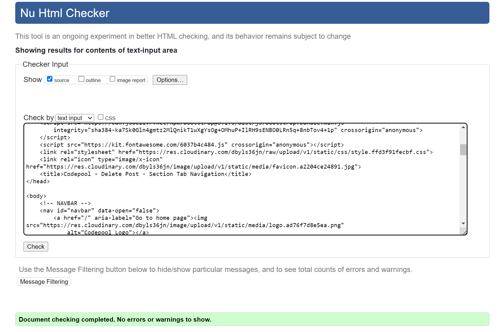 | Validated by Input |
| Delete Comment |  | Validated by Input |
| New Post |  | Validated by Input |
| Categories |  | Validated by Input |
| Edit Category |  | Validated by Input |
| Delete Category |  | Validated by Input |
| Add Category |  | Validated by Input |
| Log Out |  | Validated by Input |
| Sign In |  | Validated by URL |
| Sign Up |  | Validated by URL |

### CSS

Result from [W3C CSS Validation Service](https://jigsaw.w3.org/css-validator) for style.css. The code was validated by copying and pasting the code directly to the validator:


### JavaScript

I have used the recommended [JShint Validator](https://jshint.com) to validate all of my JS files.


| File | Screenshot | Notes |
| --- | --- | --- |
| script.js |  | Unused variables from external files |
| index.js |  | Undefined variables declared on script.js |
| post.js |  | Undefined variables declared on script.js |
| post_detail.js | 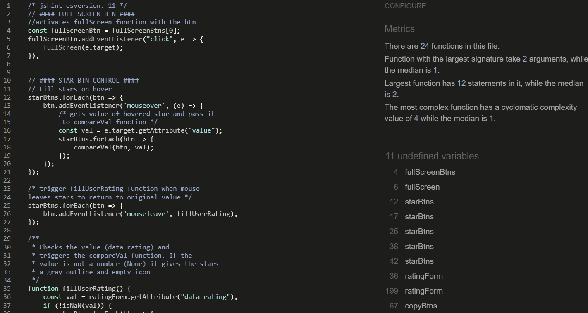 | Undefined variables declared on script.js |
| add_edit_post.js |  | Undefined variables declared on script.js |


### Python

I have used the recommended [CI Python Linter](https://pep8ci.herokuapp.com) to validate all of my Python files.

#### Codepool folder

| File | URL |
| --- | --- |
| Codepool *asgi.py* | https://pep8ci.herokuapp.com/https://raw.githubusercontent.com/cilliagustin/codepool/main/codepool/asgi.py |
| Codepool *settings.py* | https://pep8ci.herokuapp.com/https://raw.githubusercontent.com/cilliagustin/codepool/main/codepool/settings.py |
| Codepool *urls.py* | https://pep8ci.herokuapp.com/https://raw.githubusercontent.com/cilliagustin/codepool/main/codepool/urls.py |
| Codepool *wsgi.py* | https://pep8ci.herokuapp.com/https://raw.githubusercontent.com/cilliagustin/codepool/main/codepool/wsgi.py |

#### Forum folder

| File | URL |
| --- | --- |
| Forum *admin.py* | https://pep8ci.herokuapp.com/https://raw.githubusercontent.com/cilliagustin/codepool/main/forum/admin.py |
| Forum *apps.py* | https://pep8ci.herokuapp.com/https://raw.githubusercontent.com/cilliagustin/codepool/main/forum/apps.py |
| Forum *forms.py* | https://pep8ci.herokuapp.com/https://raw.githubusercontent.com/cilliagustin/codepool/main/forum/forms.py |
| Forum *models.py* | https://pep8ci.herokuapp.com/https://raw.githubusercontent.com/cilliagustin/codepool/main/forum/models.py |
| Forum *test_forms.py* | https://pep8ci.herokuapp.com/https://raw.githubusercontent.com/cilliagustin/codepool/main/forum/test_forms.py |
| Forum *test_models.py* | https://pep8ci.herokuapp.com/https://raw.githubusercontent.com/cilliagustin/codepool/main/forum/test_models.py |
| Forum *test_views.py* | https://pep8ci.herokuapp.com/https://raw.githubusercontent.com/cilliagustin/codepool/main/forum/test_views.py |
| Forum *urls.py* | https://pep8ci.herokuapp.com/https://raw.githubusercontent.com/cilliagustin/codepool/main/forum/urls.py |
| Forum *views.py* | https://pep8ci.herokuapp.com/https://raw.githubusercontent.com/cilliagustin/codepool/main/forum/views.py |


## Browser Compatibility

I've tested my deployed project using [Chrome](https://www.google.com/chrome), [Firefox](https://www.mozilla.org/firefox) and [Safari](https://support.apple.com/downloads/safari) to check for compatibility issues.

### Index
<details>
<summary>View Browser Comparison</summary>

| Browser | Screenshot | Notes |
| --- | --- | --- |
| Chrome |  | Works as expected |
| Firefox |   | Works as expected |
| Safari | 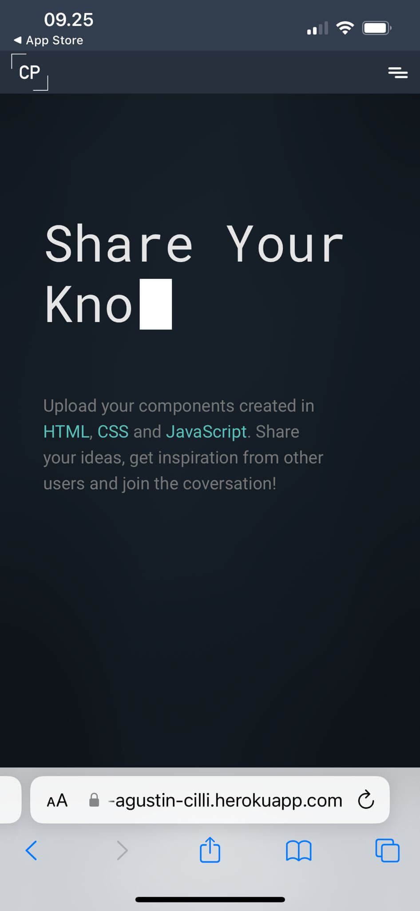  | Works as expected |

</details>


### Posts

<details>
<summary>View Browser Comparison</summary>

| Browser | Screenshot | Notes |
| --- | --- | --- |
| Chrome |  | Works as expected |
| Firefox |   | Works as expected |
| Safari | 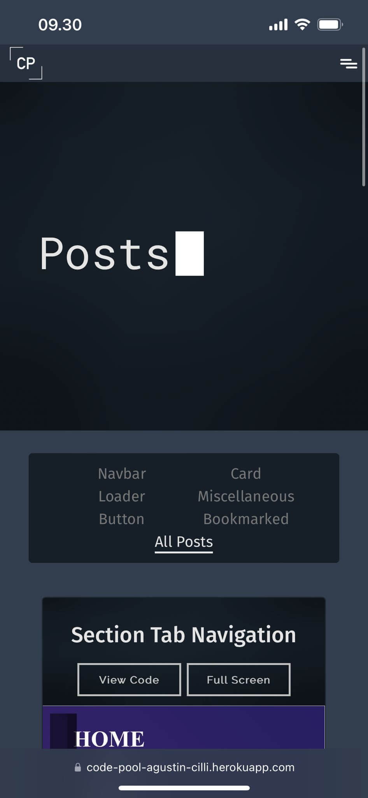  | Works as expected |

</details>

### Post-detail

<details>
<summary>View Browser Comparison</summary>

| Browser | Screenshot | Notes |
| --- | --- | --- |
| Chrome |   [screenshot](documentation/screenshots/chrome-post-detail-3.png)| Works as expected |
| Firefox |   [screenshot](documentation/screenshots/mozilla-post-detail-3.png) | Works as expected |
| Safari |  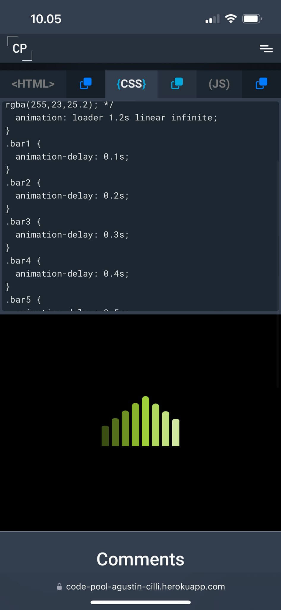 [screenshot](documentation/screenshots/safari-post-detail-3.jpeg) | Works as expected |

</details>

### Edit Post

<details>
<summary>View Browser Comparison</summary>

| Browser | Screenshot | Notes |
| --- | --- | --- |
| Chrome |  | Works as expected |
| Firefox |   | Works as expected |
| Safari |   | Works as expected |

</details>

### Delete Post

<details>
<summary>View Browser Comparison</summary>

| Browser | Screenshot | Notes |
| --- | --- | --- |
| Chrome |  | Works as expected |
| Firefox |  | Works as expected |
| Safari | 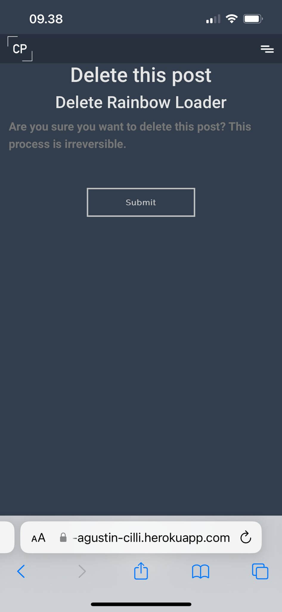 | Works as expected |

</details>

### New Post

<details>
<summary>View Browser Comparison</summary>

| Browser | Screenshot | Notes |
| --- | --- | --- |
| Chrome |  | Works as expected |
| Firefox |   | Works as expected |
| Safari |   | Works as expected |

</details>


### Categories

<details>
<summary>View Browser Comparison</summary>

| Browser | Screenshot | Notes |
| --- | --- | --- |
| Chrome |  | Works as expected |
| Firefox |  | Works as expected |
| Safari |  | Works as expected |

</details>

### Edit Category

<details>
<summary>View Browser Comparison</summary>

| Browser | Screenshot | Notes |
| --- | --- | --- |
| Chrome |  | Works as expected |
| Firefox |  | Works as expected |
| Safari |  | Works as expected |

</details>

### Delete Category

<details>
<summary>View Browser Comparison</summary>

| Browser | Screenshot | Notes |
| --- | --- | --- |
| Chrome |  | Works as expected |
| Firefox |  | Works as expected |
| Safari |  | Works as expected |

</details>

### New Category

<details>
<summary>View Browser Comparison</summary>

| Browser | Screenshot | Notes |
| --- | --- | --- |
| Chrome |  | Works as expected |
| Firefox |  | Works as expected |
| Safari |  | Works as expected |

</details>

### Sign In

<details>
<summary>View Browser Comparison</summary>

| Browser | Screenshot | Notes |
| --- | --- | --- |
| Chrome |  | Works as expected |
| Firefox |  | Works as expected |
| Safari |  | Works as expected |

</details>

### Sign Up

<details>
<summary>View Browser Comparison</summary>

| Browser | Screenshot | Notes |
| --- | --- | --- |
| Chrome |  | Works as expected |
| Firefox |  | Works as expected |
| Safari |  | Works as expected |

</details>

### Log Out

<details>
<summary>View Browser Comparison</summary>

| Browser | Screenshot | Notes |
| --- | --- | --- |
| Chrome |  | Works as expected |
| Firefox |  | Works as expected |
| Safari | 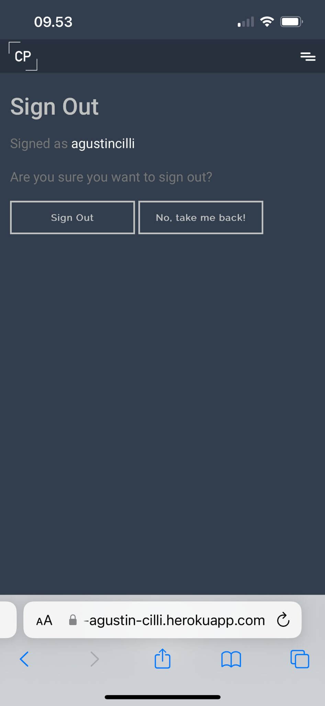 | Works as expected |

</details>

## Responsiveness

I've tested my deployed project on multiple devices to check for responsiveness issues. The Screenshoots provided now for the desktop and mobile versions will be the same ones shown in the browser compatibility comparision since I have checked [Google Chrome](https://www.google.com/chrome) on my desktop and [Safari](https://support.apple.com/downloads/safari) on my Iphone 14. The screenshots used for the Tablet version were taken using a tablet resolution on Chrome developer tools.

### Index
<details>
<summary>View Responsiveness Comparison</summary>

| Device | Screenshot | Notes |
| --- | --- | --- |
| Desktop |  | Works as expected |
| Tablet (Devtools) |   | Works as expected |
| Mobile (Iphone 14) |   | Works as expected |

</details>


### Posts 

<details>
<summary>View Responsiveness Comparison</summary>

| Device | Screenshot | Notes |
| --- | --- | --- |
| Desktop |  | Works as expected |
| Tablet (Devtools) |   | Works as expected |
| Mobile (Iphone 14) |   | Works as expected |

</details>

### Post-detail 

<details>
<summary>View Responsiveness Comparison</summary>

| Device | Screenshot | Notes |
| --- | --- | --- |
| Desktop |   [screenshot](documentation/screenshots/chrome-post-detail-3.png)| Works as expected |
| Tablet (Devtools) |   [screenshot](documentation/screenshots/tablet-post-detail-3.png) | Works as expected |
| Mobile (Iphone 14) |   [screenshot](documentation/screenshots/safari-post-detail-3.jpeg) | Works as expected |

</details>

### Edit Post 

<details>
<summary>View Responsiveness Comparison</summary>

| Device | Screenshot | Notes |
| --- | --- | --- |
| Desktop |  | Works as expected |
| Tablet (Devtools) | 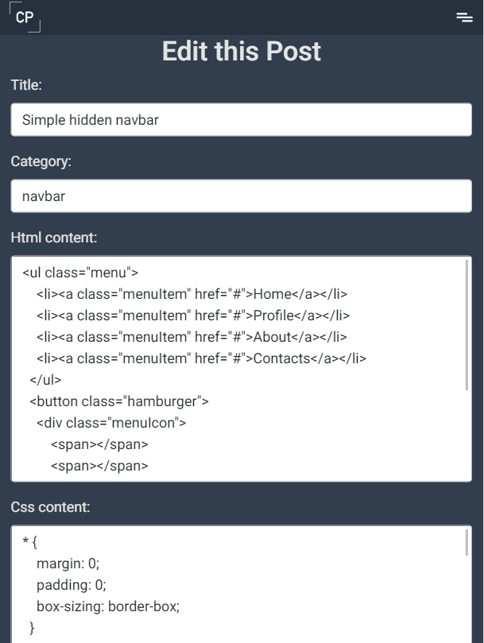  | Works as expected |
| Mobile (Iphone 14) |   | Works as expected |

</details>

### Delete Post 

<details>
<summary>View Responsiveness Comparison</summary>

| Device | Screenshot | Notes |
| --- | --- | --- |
| Desktop |  | Works as expected |
| Tablet (Devtools) |  | Works as expected |
| Mobile (Iphone 14) |  | Works as expected |

</details>

### New Post 

<details>
<summary>View Responsiveness Comparison</summary>

| Device | Screenshot | Notes |
| --- | --- | --- |
| Desktop |  | Works as expected |
| Tablet (Devtools) |  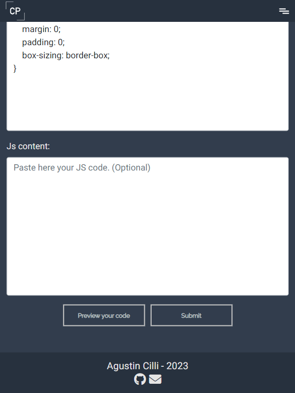 | Works as expected |
| Mobile (Iphone 14) |   | Works as expected |

</details>


### Categories 

<details>
<summary>View Responsiveness Comparison</summary>

| Device | Screenshot | Notes |
| --- | --- | --- |
| Desktop |  | Works as expected |
| Tablet (Devtools) |  | Works as expected |
| Mobile (Iphone 14) |  | Works as expected |

</details>

### Edit Category 

<details>
<summary>View Responsiveness Comparison</summary>

| Device | Screenshot | Notes |
| --- | --- | --- |
| Desktop |  | Works as expected |
| Tablet (Devtools) |  | Works as expected |
| Mobile (Iphone 14) |  | Works as expected |

</details>

### Delete Category 

<details>
<summary>View Responsiveness Comparison</summary>

| Device | Screenshot | Notes |
| --- | --- | --- |
| Desktop |  | Works as expected |
| Tablet (Devtools) |  | Works as expected |
| Mobile (Iphone 14) |  | Works as expected |

</details>

### New Category 

<details>
<summary>View Responsiveness Comparison</summary>

| Device | Screenshot | Notes |
| --- | --- | --- |
| Desktop |  | Works as expected |
| Tablet (Devtools) |  | Works as expected |
| Mobile (Iphone 14) |  | Works as expected |

</details>

### Sign In 

<details>
<summary>View Responsiveness Comparison</summary>

| Device | Screenshot | Notes |
| --- | --- | --- |
| Desktop |  | Works as expected |
| Tablet (Devtools) | 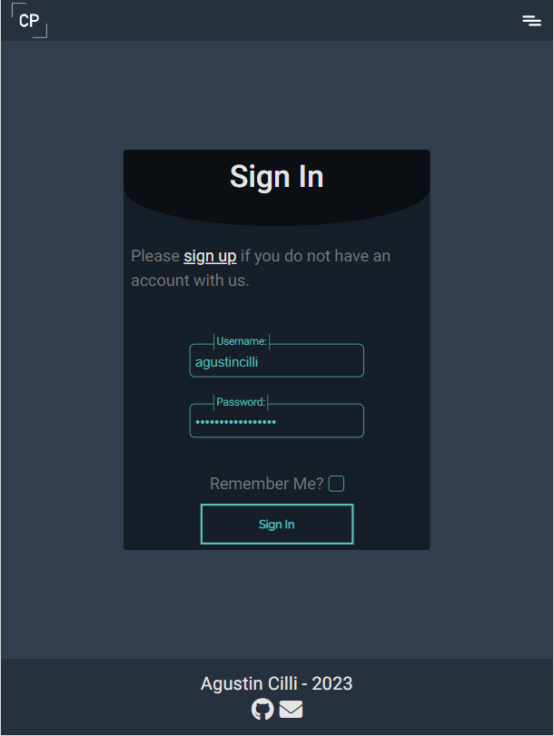 | Works as expected |
| Mobile (Iphone 14) |  | Works as expected |

</details>

### Sign Up 

<details>
<summary>View Responsiveness Comparison</summary>

| Device | Screenshot | Notes |
| --- | --- | --- |
| Desktop |  | Works as expected |
| Tablet (Devtools) | 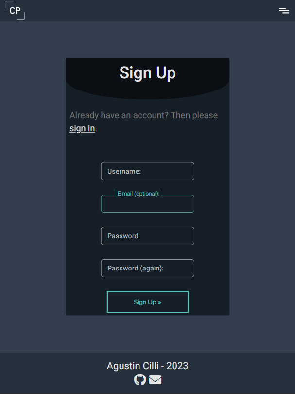 | Works as expected |
| Mobile (Iphone 14) |  | Works as expected |

</details>

### Log Out

<details>
<summary>View Responsiveness Comparison</summary>

| Device | Screenshot | Notes |
| --- | --- | --- |
| Desktop |  | Works as expected |
| Tablet (Devtools) | 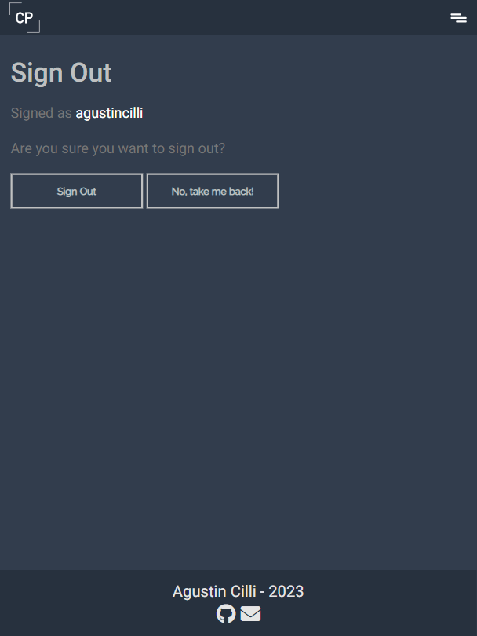 | Works as expected |
| Mobile (Iphone 14) |  | Works as expected |

</details>

## Lighthouse Audit
I've tested my deployed project using the Lighthouse Audit tool to check for any major issues.

| Page | Screenshot |
| --- | --- |
| Home |  |
| Posts |  |
| Bookmarked Posts |  |
| Filtered by Category Posts |  |
| Post Detail |  |
| Edit Post | 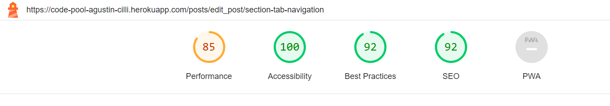 |
| Delete Post |  |
| New Post |  |
| Categories | 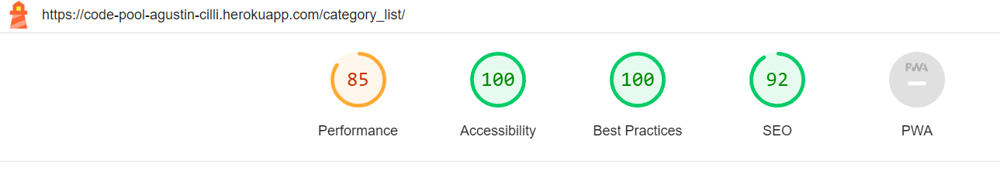 |
| Edit Category |  |
| Delete Category |  |
| New Category |  |
| Sign In |  |
| Sign Up |  |


## Defensive Programming


| Page | User Action | Expected Result | Pass/Fail | Comments |
| --- | --- | --- | --- | --- | 
| Navbar | | | | | 
| | Click on Logo / Home link | Redirection to Home page | Pass | |
| | Click on Browse Posts Link | Redirection to Posts page | Pass | |
| | Click on New Post Link | Redirection to New Post page | Pass | |
| | Click on Browse Categories Link | Redirection to Categories page | Pass | |
| | Click on New Category Link | Redirection New category page | Pass | |
| | Click on Sign In Link | Redirection to Sign In page | Pass | |
| | Click on Sign up Link | Redirection to Sign up page | Pass | |
| | Click on Log Out Link | Redirection to Log Out page | Pass | |
| Home Page | | | | |
| | Click View Code Link on Preview Card | Redirection to Post Detail page | Pass | |
| | Click Full Screen button on Preview Card | Opens an iframe that shows the code on Full Screen | Pass | |
| | Click Post Category badge on Preview Card | Redirection to Filtered by Category Posts page | Pass | |
| | Click Post Bookmarked badge on Preview Card | Redirection to Bookmarked Filtered Posts page | Pass | This badge is only visible for registered users on posts they have prevously bookmarked |
| | Click view all posts Link | Redirection to Posts page | Pass | | |
| Posts Page | | | | |
| | Click View Code Link on Preview Card | Redirection to Post Detail page | Pass | |
| | Click Full Screen button on Preview Card | Opens an iframe that shows the code on Full Screen | Pass | |
| | Click Post Category badge on Preview Card | Redirection to Filtered by Category Posts page | Pass | |
| | Click Post Bookmarked badge on Preview Card | Redirection to Bookmarked Filtered Posts page | Pass | This badge is only visible for registered users on posts they have prevously bookmarked |
| | Click All Posts button on "Filter Navegation" element | Redirection to Posts page | Pass | |
| | Click Category button on "Filter Navegation" element | Redirection to Filtered by Category Posts page | Pass | |
| | Click Bookmark button on "Filter Navegation" element | Redirection to Bookmarked Filtered Posts page | Pass | This button is only visible for Registered Users |
| Filtered by Category Posts page | | | | |
| | Click View Code Link on Preview Card | Redirection to Post Detail page | Pass | |
| | Click Full Screen button on Preview Card | Opens an iframe that shows the code on Full Screen | Pass | |
| | Click Post Category badge on Preview Card | Redirection to Filtered by Category Posts page | Pass | |
| | Click Post Bookmarked badge on Preview Card | Redirection to Bookmarked Filtered Posts page | Pass | This badge is only visible for registered users on posts they have prevously bookmarked |
| | Click All Posts button on "Filter Navegation" element | Redirection to Posts page | Pass | |
| | Click Category button on "Filter Navegation" element | Redirection to Filtered by Category Posts page | Pass | |
| | Click Bookmark button on "Filter Navegation" element | Redirection to Bookmarked Filtered Posts page | Pass | This button is only visible for Registered Users |
| Bookmarked Filtered Posts Page | | | | |
| | Forbid access to non registered users | Display an error message to non registered users trying to access manually the URL | Pass | |
| | Click Full Screen button on Preview Card | Opens an iframe that shows the code on Full Screen | Pass | |
| | Click Post Category badge on Preview Card | Redirection to Filtered by Category Posts page | Pass | |
| | Click Post Bookmarked badge on Preview Card | Redirection to Bookmarked Filtered Posts page | Pass | This badge is only visible for registered users on posts they have prevously bookmarked |
| | Click All Posts button on "Filter Navegation" element | Redirection to Posts page | Pass | |
| | Click Category button on "Filter Navegation" element | Redirection to Filtered by Category Posts page | Pass | |
| | Click Bookmark button on "Filter Navegation" element | Redirection to Bookmarked Filtered Posts page | Pass | This button is only visible for Registered Users |
| Post Detail Page | | | | |
| | Click Post Category badge | Redirection to Filtered by Category Posts page | Pass | |
| | Click Full Screen button | Opens an iframe that shows the code on Full Screen | Pass | |
| | Click Edit Post button | Redirection to Edit Post page | Pass | Only the author of the post or a superuser can view this button |
| | Click Delete Post button | Redirection to Delete Post page | Pass | Only the author of the post or a superuser can view this button |
| | Click Bookmarked button | Will change the state of the post (bookmark True or False) when clicked | Pass | Only registered users can view this button |
| | Five Star Rating Form | Allows the user to rate or change the rating of a post when clicked. Also allows them to view their current rate submitted | Pass | Only registered users can view this form |
| | Delete Comment button | Redirection to Delete Comment page | Pass | Only the author´s comment  or a superuser can view this button |
| | Approve Comment button | Change status of comment from approved = False to True | Pass | Only a superuser can view this button |
| | Comment form | Allows the User to enter a comment | Pass | Only a regsitered user can enter a comment. The string can not be empty |
| Edit Post Page | | | | |
| | Forbid access to non authrised users | Display an error message to users trying to access manually the URL (Only a superuser or the post author can access this form) | Pass | |
| | Title Field | Field must be completed correctly to submit the form | Pass | |
| | Slug Field | Field must be completed correctly to submit the form | Pass | this field is not visible for the user but is completed transforming the title to a slug using JavaScript |
| | Category Field | A field must be selected to submit the form | Pass | |
| | HTML content Field | Field must be completed correctly to submit the form | Pass | |
| | CSS content Field | Field must be completed correctly to submit the form | Pass | |
| | JS content Field | This field is not mandatory, can be entered empty | Pass | |
| | Submit Button | Clicking this button will submit the form and edit the post | Pass | |
| | Preview your code Button | Clicking this button will open an iframe and display the entered code | Pass | |
| Delete Post Page | | | | |
| | Forbid access to non authorised users | Display an error message to users trying to access manually the URL (Only a superuser or the post author can access this form) | Pass | |
| | Delete Post Submit Button | Clicking the submit button will permanently delete the Post | Pass | |
| Delete Comment Page | | | | |
| | Forbid access to non authorised users | Display an error message to users trying to access manually the URL (Only a superuser or the post author can access this form) | Pass | |
| | Delete Post Submit Button | Clicking the submit button will permanently delete the Post | Pass | |
| New Post Page | | | | |
| | Forbid access to non registered users | Display an error message to non registered users trying to access manually the URL | Pass | |
| | Title Field | Field must be completed correctly to submit the form | Pass | |
| | Slug Field | Field must be completed correctly to submit the form | Pass | this field is not visible for the user but is completed transforming the title to a slug using JavaScript |
| | Category Field | A field must be selected to submit the form | Pass | |
| | HTML content Field | Field must be completed correctly to submit the form | Pass | |
| | CSS content Field | Field must be completed correctly to submit the form | Pass | |
| | JS content Field | This field is not mandatory, can be entered empty | Pass | |
| | Submit Button | Clicking this button will submit the form and create a new post | Pass | |
| | Preview your code Button | Clicking this button will open an iframe and display the entered code | Pass | |
| Categories Page | | | | |
| | Forbid access to non superuser | Display an error message to non superuser trying to access manually the URL | Pass | |
| | Click on Edit Category on Category Card | Redirection to Edit Category page  | Pass | |
| | Click on Delete Category on Category Card | Redirection to Delete Category page  | Pass | |
| Edit Category Page | | | | |
| | Forbid access to non superuser | Display an error message to non superuser trying to access manually the URL | Pass | |
| | Name Field | Field must be completed correctly to submit the form | Pass | |
| | Submit Button | Clicking this button will submit the form and edit the category | Pass | |
| Delete Category Page | | | | |
| | Forbid access to non superuser | Display an error message to non superuser trying to access manually the URL | Pass | |
| | Delete Post Submit Button | Clicking the submit button will permanently delete the Post | Pass | |
| New Category Page | | | | |
| | Forbid access to non superuser | Display an error message to non superuser trying to access manually the URL | Pass | |
| | Name Field | Field must be completed correctly to submit the form | Pass | |
| | Submit Button | Clicking this button will submit the form and edit the category | Pass | |
| Sign In Page | | | | |
| | Forbid access to registered users | If a already registered user tries to manually access the URL it will be redirected to the Home page | Pass | |
| | Sign Pp form Link | Redirection to Sign Up page| Pass | |
| | Username and Password fields | This fields must be entered with the correct information of a registered user to Sign In | Pass | |
| | Submit Button | Clicking this button will submit the form in order to Sign In | Pass | |
| Sign Up Page | | | | |
| | Forbid access to registered users | If a already registered user tries to manually access the URL it will be redirected to the Home page | Pass | |
| | Sign In form Link | Redirection to Sign In page| Pass | |
| | Username field | Field must be completed correctly to submit the form | Pass | |
| | Email field | This field is not mandatory, but if completed must use a valid email address | Pass | |
| | Passwords field | Fields must be completed correctly and identically to submit the form | Pass | |
| | Submit Button | Clicking this button will submit the form in order to Sign Up | Pass | |
| Log Out Page | | | | |
| | Forbid access to non registered users | If a non registered user tries to manually access the URL it will be redirected to the Home page | Pass | | |
| | Submit Button | Clicking this button will submit the form in order to Log Out | Pass | |
| | "No, Take me back" Button | Redirection to Home page | Pass | |

## User Story Testing

### Regular users (non registered)
| User Story | Screenshot |
| --- | --- |
| As a User I can view all the code components shared so that copy them and use them in my own projects |  |
| As a User I can filter the code components by category or bookmarked posts so that I can easily find the post that I want |  |
| As a user I can open a component shared so that see the code used in HTML, CSS and Js |  |
| As a user I can View comments in posts so that see what other people think |  |
| As a user I can regsiter and become a registered user so that comment and like posts, and create my own posts |  |
| As a user I can preview shared elements so that decide if I am interested in the element before looking at the code |  |
| As a User I can view the newest code components shared on the home page so that I can easily be updated with the newest components |  |
| As a User I can open the iframe in full screen on the preview cards so that I can see the code component in a bigger scale |  |

### Registered Users
| User Story | Screenshot |
| --- | --- |
| As a registered user I can delete a post created by me so that I can remove it completely in case I don´t want it on the website |  |
| As a registered user I can edit my own posts so that make a correction in case I have a mistake |  |
| As a Registered User I can comment posts so that I can share my opinion about other users components | 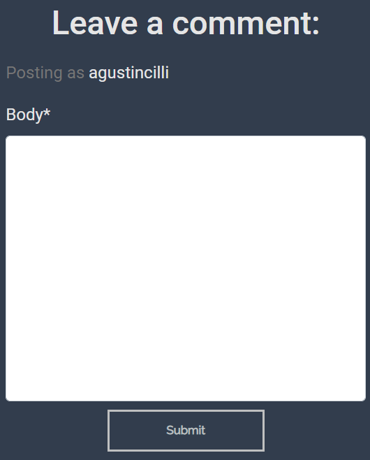 |
| As a Registered User I can create a post with my code so that I can share and store somewhere the components I created |  |
| As a Registered User I can add or remove a post to bookmarked so that easily find it |  |
| As a Registered user I can rate a post from 1 to 5 so that share my opinion and view other users opinions |  |
| As a registered user I can delete my comments from any post so that take down my comment if i commented on the wrong post |  |

### Site Admin
| User Story | Screenshot |
| --- | --- |
| As a Site admin I can delete posts and comments so that manage the content in the site |  |
| As a Site Admin I can approve comments so that I can filter unnecessary comments in the website |  |

## Automated Testing

I have conducted a series of automated tests on my application.

I fully acknowledge and understand that, in a real-world scenario, an extensive set of additional tests would be more comprehensive.


### Python (Unit Testing)

I have used Django's built-in unit testing framework to test the application functionality.

In order to run the tests, I ran the following command in the terminal each time:

`python3 manage.py test name-of-app `

To create the coverage report, I would then run the following commands:

`coverage run --source=name-of-app manage.py test`

`coverage report`

To see the HTML version of the reports, and find out whether some pieces of code were missing, I ran the following commands:

`coverage html`

`python3 -m http.server`

Here are the results of the tests i conducted:

#### forms.py test

Throughout the forms testing, I made an effort to test all the fields. However, while testing the PostForm and EditForm, I encountered an error when attempting to verify that the "js_content" field was not required. I attempted to use the following test:
```python
    def test_js_content_is_not_required(self):
        form = PostForm({'js_content': ''})
        self.assertTrue(form.is_valid())
```
This test resulted in an error indicating that the field was required, despite being marked as not required in the forms.py file. As a result, I made the decision to remove this test from the file. The end result was as follows:

After many attempts to fix this i decided to delete this tests leaving me with the first result shown.

#### models.py test

#### views.py test


Below are the results of the coverage percentage of my testing:

| App | File | Coverage |
| --- | --- | --- |
| forum | forms.py | 100% |
| forum | test_forms.py | 100% |
| forum | models.py | 100% |
| forum | test_models.py | 98% |
| forum | views.py | 99% |
| forum | test_views.py | 100% |

<details>
<summary>View HTML Report</summary>


</details>


## Bugs

### Fixed Bugs

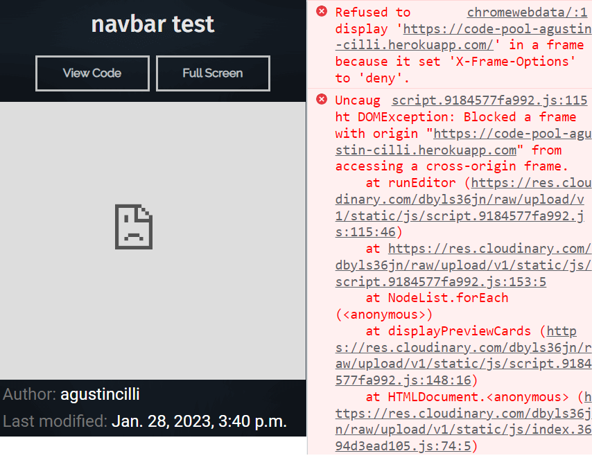

- During the development of Codepool, I encountered a bug related to displaying user-provided HTML, CSS, and JS code on an iframe. Initially, I created a view that didn't show any data and used an empty template to display the code on the iframe. However, this approach led to an error indicating that the X-Frame-Options were set to deny and that I didn't have access to edit the template to manually inject the code into the iframe. To fix this issue, I modified the view by generating an HTTP response that allowed access to the X-Frame-Options and set the Access-Control-Allow-Origin to my domain. This change enabled me to inject the user-provided HTML, CSS, and JS code into the iframe without producing any errors.

### Unfixed Bugs

There are no remaining bugs that I am aware of.
